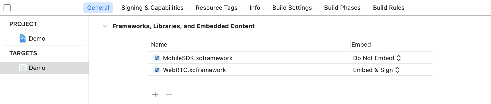

# Anonymous Call Mobile SDK User Guide for iOS
Version Number: **$SDK_VERSION$**
<br>
Revision Date: **October 31, 2022**

## Anonymous Call Mobile SDK overview

The SPiDR/Kandy Link Anonymous Call Mobile Software Development Kit (SDK) defines a library implementation supporting SPiDR/Kandy Link platform features like anonymous call management (allowing unregistered users to place voice or video calls) and WebRTC on iOS. You can use this library implementation to integrate SPiDR/Kandy Link services and WebRTC into your native mobile applications to create new, innovative user experiences.

The Anonymous Call Mobile SDK has the following characteristics:

* supports REST over HTTP/HTTPS for integration with the presentation layer of SPiDR/Kandy Link
* supports WebSocket for notification
* classes contain a prefix "SM" ("SPiDR Mobile") to prevent conflicts with developer classes
* access to REST APIs provided by Ribbon's Kandy platform

See [Appendix A: High-level Anonymous Call Mobile SDK structure](#appendix-a-high-level-anonymous-call-mobile-sdk-structure) for a high-level view of the Anonymous Call Mobile SDK and its sub-modules.

The Anonymous Call Mobile SDK for iOS is compatible with iOS 9.x-12.x and has been tested on iPhone 4S, 5, 5C, 5S, 6, 6+, 6S, 6S+, 7, 7+, 8, 8+, X, iPad mini, iPad 4, and iPad Air. The SDK supports IPv6 for iOS.

### What's in this document?

This document provides help getting started developing your mobile application using the Anonymous Mobile SDK for iOS. This guide contains:

* Steps to create your Xcode project using the Anonymous Call Mobile SDK
* Sample code to illustrate common tasks

### Before you start developing your application

The following items need to be complete prior to beginning work on your application:

* Your Xcode development environment is set up and ready for new projects.
* You know the IP address and port of the SPiDR/Kandy Link server.

<div class="page-break" />

## Get Started

### Installation

This section contains the required steps for beginning your mobile application development and an example of using the Anonymous Call Mobile SDK in Xcode 10.x.

#### Creating your Xcode project

1. Open the Xcode application.
2. Click Create a new Xcode project.
3. Click Application, located under the iOS heading in the left-side panel.
4. Click Single View Application for your project template.


5. Click Next.
6. Type your project details and click Next.
7. Select a location for your project and click Create.
8. Select one of the installation methods below

#### Cocoapods
1. Add below pods to your Podfile (If you dont have any Podfile, visit this link to install cocoapods: https://guides.cocoapods.org/using/using-cocoapods.html)

```ruby
...

target 'YOUR_TARGET_NAME' do
    pod 'KandyLinkMobileSDKAnonymous', '~> $SDK_VERSION$ '
end

post_install do |installer|
  installer.pods_project.targets.each do |target|
    target.build_configurations.each do |config|
      config.build_settings['ENABLE_BITCODE'] = 'NO'
    end
  end
end

...
```

2. Go to project folder via command line and run "pod install" command and wait for cocoapods to finish installation of MobileSDK ,WebRTC frameworks and their dependencies

If you have a trouble with getting latest version of **Kandy Link Anonymous iOS SDK** plaese run these suggested commands [here](https://gist.github.com/mbinna/4202236) in project directory where Podfile is located.

#### Swift Package Manager Installation
1. File >Add Package Dependency
2. 
3. Add https://github.com/Kandy-IO/kandy-anonymous-ios-sdk.git
4. 
5. Select "Branch" with "master"

#### Manual Installation
**IMPORTANT:** This installation section applies to **Kandy Link Anonymous iOS SDK** versions prior to v5.17.0. If you are using a more recent version, follow the instructions [here](?id=manual-installation-after-v5170).

Before those steps you need to download **Kandy Link Anonymous iOS SDK** framework file from [this link](https://raw.githubusercontent.com/Kandy-IO/kandy-anonymous-ios-sdk/$SDK_VERSION$/dist/MobileSDKAnonymous_$SDK_VERSION$.zip).

1. Navigate to Build Phases and scroll down to Link binary with libraries.
2. Add MobileSDKAnonymous.framework under Link binary with libraries.
3. Add WebRTC.framework under the **Embedded Binaries** section in **General** tab on Project Settings. Select **Copy items if needed**.


4. Add the following iOS SDK frameworks to your application:

  * AvFoundation.framework
	* SystemConfiguration.framework
	* GLKit.framework
	* VideoToolbox.framework
	* AudioToolbox.framework
	* libc++.tbd
	* libicucore.tbd

5. Anonymous Mobile SDK doesn't support bitcode, under the "Build Settings" search for "Bitcode", and change "Enable Bitcode" option to NO.


6. "-ObjC" flag should be added to "Other Linker Flags" options under the "Build Settings".


#### Manual Installation (After v5.17.0)
Support for XCFramework has been added to **Kandy Link Anonymous iOS SDK** with the v5.17.0 release. You can install **Kandy Link iOS SDK** as XCFramework by following the steps below. (More information about XCFramework, see [link](https://help.apple.com/xcode/mac/11.4/#/dev6f6ac218b)).

First of all, you must have the **Kandy Link Anonymous iOS SDK** XCFramework file for installation. You can download from [this link](https://raw.githubusercontent.com/Kandy-IO/kandy-anonymous-ios-sdk/$SDK_VERSION$/dist/MobileSDKAnonymous_$SDK_VERSION$.zip).

1. Go to project settings and navigate to **General**.
2. Add **MobileSDKAnonymous.xcframework** and **WebRTC.xcframework** under **Framework, Libraries, and Embedded Content** section.



3. Add the following iOS SDK frameworks to your application:

  * AvFoundation.framework
	* SystemConfiguration.framework
	* GLKit.framework
	* VideoToolbox.framework
	* AudioToolbox.framework
	* libc++.tbd
	* libicucore.tbd
 

4. Anonymous Mobile SDK doesn't support bitcode, under the "Build Settings" search for "Bitcode", and change "Enable Bitcode" option to NO.


5. "-ObjC" flag should be added to "Other Linker Flags" options under the "Build Settings".


### Post Installation Steps
1. Add usage descriptions for both camera and microphone access should be added to application's Info.plist file.

```tag
<key>NSCameraUsageDescription</key>
<string>Your camera usage description message should be added here like this.</string>
<key>NSMicrophoneUsageDescription</key>
<string>Your microphone usage description message should be added here like this.</string>
```

<br><br>

### Enable background processing

The application must support background processing while on an active call, allowing SDK to process WebSocket operations even after the user presses the Home button, the Sleep/Wake button, or if another application is launched.

To enable background processing, add the "UIBackgroundModes" key to your app's **Info.plist** file. Set the value of this key to an array that includes the **voip** string.


You can now use the Anonymous Mobile SDK in your code implementation.

### Set application configuration

First, you must access and modify the Configuration utility to update attributes such as REST server IP or Port. The Anonymous Call Mobile SDK receives data from the Configuration utility, and the third-party mobile application (third-party app) must provide necessary data to the Configuration utility.

To see all available configurations, see [Appendix D: Detailed Configurations](#appendix-d-detailed-configurations)

###### Example: Accessing and updating Configuration

<!-- tabs:start -->

#### ** Objective-C Code **

```objectivec
#import <MobileSDKAnonymous/MobileSDKAnonymous.h>

- (void) manageConfiguration
{
   //access SMConfiguration instance
   SMConfiguration * configuration =  [SMConfiguration getInstance];

   //after gathering the Configuration
   //a property X can be accessed as
   //configuration.X --> getter
   //configuration.X = --> setter

   //set minimum Configuration values
   //server IP value for SPiDR/Kandy Link
   configuration.restServerIP = @"$SUBSCRIPTIONFQDN$";
   //server port value for SPiDR/Kandy Link
   configuration.restServerPort = @"443";
   //logger implementation defined by application
   configuration.logger = self;

   //IP used in websocket connection creation.
   // If not provided, Rest Server IP will be used
   configuration.webSocketServerIP  =@"$WEBSOCKETFQDN$";
   //port used in websocket connection creation
   configuration.webSocketServerPort  =@"443";

   // add ICE Server
   SMICEServers *servers = [[SMICEServers alloc] init];
   [servers addICEServer:@"$TURNSERVER1$"];
   [servers addICEServer:@"$TURNSERVER2$"];
   [servers addICEServer:@"$STUNSERVER1$"];
   [servers addICEServer:@"$STUNSERVER2$"];
   [configuration setICEServers:servers];
}
```
#### ** Swift Code **

```swift
import MobileSDKAnonymous

func manageConfiguration() {
    //access SMConfiguration instance
    let configuration = SMConfiguration.getInstance()

    //after gathering the Configuration
    //a property X can be accessed as
    //configuration.X --> getter
    //configuration.X = --> setter

    //set minimum Configuration values
    //server IP value for SPiDR/Kandy Link
    configuration.restServerIP = "$SUBSCRIPTIONFQDN$"
    //server port value for SPiDR/Kandy Link
    configuration.restServerPort = "443"
    //logger implementation defined by application
    configuration.logger = self

    //IP used in websocket connection creation
    // If not provided, Rest Server IP will be used
    configuration.webSocketServerIP  = "$WEBSOCKETFQDN$"
    //port used in websocket connection creation
    configuration.webSocketServerPort  = "443"

    // add ICE Server
    let servers = SMICEServers()
    servers.addICEServer("$TURNSERVER1$")
    servers.addICEServer("$TURNSERVER2$")
    servers.addICEServer("$STUNSERVER1$")
    servers.addICEServer("$STUNSERVER2$")
    configuration.iceServers = servers
}
```
<!-- tabs:end -->

### Set up logging functionality

Logging provides a way to trace process execution. The Log Manager is defined to handle logging requests made by the Mobile SDK. The Log Manager does not process the logging messages, rather it receives logging message requests and delivers them to the logger defined in the Configuration utility (logger is initially "null"; you must set an object which conforms to LoggingInterface methods in the Configuration utility).

###### Example: Define logger

<!-- tabs:start -->

#### ** Objective-C Code **

```objectivec
#define CONSOLE_LOG_PATH [[NSSearchPathForDirectoriesInDomains(NSCachesDirectory, NSUserDomainMask, YES) objectAtIndex:0] stringByAppendingPathComponent:@"consoleLog.log"]

@interface ExampleLogger : NSObject <SMLoggingDelegate>

@end

@implementation ExampleLogger
    NSFileHandle *myHandle;
    - (id)init
    {
        self = [super init];
        if (self) {
            SMConfiguration * configuration = [SMConfiguration getInstance];
            configuration.logLevel = TRACE;
            configuration.logger = self;
            [self initLogFile];
        }
        return self;
    }
    - (void) initLogFile {
        if(myHandle) [myHandle closeFile];
        
        if(![[NSFileManager defaultManager] fileExistsAtPath:CONSOLE_LOG_PATH])
            [@"" writeToFile:CONSOLE_LOG_PATH atomically:YES encoding:NSUTF8StringEncoding error:nil];
        
        NSLog(@"Log File Path: %@", CONSOLE_LOG_PATH);
        myHandle = [NSFileHandle fileHandleForUpdatingAtPath:CONSOLE_LOG_PATH];
    }

    -(void)log:(SMLogLevel)logLevel withLogContext:(NSString *)logContext withMethodName:(SEL) methodName withMessage:(NSString*)logMessage{
        NSString *methodStr = NSStringFromSelector(methodName);
        
        NSString *msg =[NSString stringWithFormat:@"[%@] <%@-%@>: %@",levelStr, logContext, methodStr, logMessage];
        NSLog(@"%@", msg);
        NSString *dateString = [NSDateFormatter localizedStringFromDate:[NSDate date]
                                                          dateStyle:NSDateFormatterShortStyle
                                                          timeStyle:NSDateFormatterMediumStyle];
        [myHandle seekToEndOfFile];
        [myHandle writeData:[[dateString stringByAppendingFormat:@": %@\n", msg] dataUsingEncoding:NSUTF8StringEncoding]];
    }
@end
```

#### ** Swift Code **

```swift
class ExampleLogger : NSObject, SMLoggingDelegate {
    private var handler: FileHandle?
    private override init() {
        super.init()
        let conf = SMConfiguration.getInstance()
        conf.logLevel = .trace
        conf.logger = self
        self.initLogFile()
    }
    private func initLogFile() {
        let destPath = NSSearchPathForDirectoriesInDomains(.documentDirectory, .userDomainMask, true).first!
        let fullDestPath = NSURL(fileURLWithPath: destPath).appendingPathComponent("ExampleLogger.log")
        let fullDestPathString = fullDestPath!.path
        if !FileManager.default.fileExists(atPath: fullDestPathString) {
            do {
                try "".write(toFile: fullDestPathString, atomically: true, encoding: String.Encoding.utf8)
            } catch {
                NSLog("Can't write to file to device directory - Error: \(error.localizedDescription)")
            }
        }
        handler = FileHandle.init(forUpdatingAtPath: fullDestPathString)
    }

    func log(_ logLevel: SMLogLevel, withLogContext logContext: String, withMethodName methodName: Selector?, withMessage logMessage: String) {
        let dateStr = DateFormatter.localizedString(from: Date(), dateStyle: .short, timeStyle: .medium)
        let logString = "\(dateStr) : \(logContext) - \(logMessage)"
        print(logString)
        if let logData = logString.data(using: String.Encoding.utf8) {
            handler?.write(logData)
        }
    }

}
```
<!-- tabs:end -->

##### Log Levels
###### Trace_WebRTC
The application developer should use this level to view all webrtc and SDK logs.
###### Trace
This is really fine-grained information. When you're at this level, you're basically looking to capture every detail you possibly can about the application's behavior. Think of this level as the method you should use for all the logging you will do while tracking a specific problem and most likely get rid of it once you find the problem.

App developer should use this level to view all messages on the sdk side. The logs coming from this level will lead to the solution of the SDK error. However, it should be noted that webrtc logs will not be displayed at this level.
###### Info
Info messages correspond to normal application behavior. They provide the skeleton of what happened. A service started or stopped. The notification engine started, you got a new message or network status changed. Think of it as all the messages you'd like to see in the log when creating call for example, or in other words - anything that might help you resolve or at least identify a problem without looking in the source code.

Logs at this level can either solve the problem or have ideas to solve the problem, but this is not guaranteed. It contains less information than the trace level.However, it should be noted that webrtc logs will not be displayed at this level.
###### Warning
Use this log level to indicate that you might have a problem and that you've detected an unusual situation. Maybe you were trying to invoke a service and it failed a couple of times before connecting on an automatic retry or you were trying to start a service which already running. It's unexpected and unusual, but no real harm done, and it's not known whether the issue will persist or recur. The application can tolerate warning messages, but they should always be justified and examined.

This level can be use to see errors and warnings from Sdk. Developer can view where the error is, but may not be able to find root cause of an error.Webrtc logs will not be displayed at this level
###### Error
An error is a serious issue and represents the failure of something important going on in your application. No system can tolerate items logged on this level. Maybe you've got something like dropped WebSocket connections or the inability to access a service.

This level can be use to see only errors from Sdk. Developer can view where the error is, but may not be able to find root cause of an error.Webrtc logs will not be displayed at this level

###### Example: Initialize logger

<!-- tabs:start -->

#### ** Objective-C Code **

```objectivec
- (void) initializeAndUseLogger
{
    SMConfiguration * configuration = [SMConfiguration getInstance];
    ExampleLogger    * exampleLogger    = [[ExampleLogger alloc] init];
    NSLog(@"logger is initialized");
}
```

#### ** Swift Code **

```swift
func initializeAndUseLogger() {
    let configuration = SMConfiguration.getInstance()
    let exampleLogger = ExampleLogger()

    NSLog("Logger is initialized")
}
```
<!-- tabs:end -->

<div class="page-break"></div>

## Basic Usage

### Listen Call Service notifications

To receive event notifications of Anonymous Call Mobile SDK, `SMCallApplicationDelegate` should be implemented by calling `setCallApplication:`.

Anonymous calls can be manipulated with methods such as mute/unmute and start/stop video, and results of the operations will be delivered via notification mechanism.

###### Example: Setting Call Application Delegate

<!-- tabs:start -->

#### ** Objective-C Code **

```objectivec
#import <MobileSDKAnonymous/MobileSDKAnonymous.h>

@interface CallController () <SMCallApplicationDelegate>
@end

@implementation CallController

- (void) viewDidLoad {
		[super viewDidLoad];
  	[[[SMServiceProvider getInstance] getCallService] setCallApplication:self];
}

@end
```

#### ** Swift Code **

```swift
import MobileSDKAnonymous

class CallController: NSObject, SMCallApplicationDelegate {

    func viewDidLoad() {
				super.viewDidLoad()
				SMServiceProvider.getInstance().getCallService().setCallApplication(self)
    }

}
```
<!-- tabs:end -->

<div class="page-break"></div>

### Add STUN/TURN servers

SPiDR/Kandy Link provides TURN server support for media relay between two WebRTC endpoints in core version 3.0 and later. The ICEServers property in the SMConfiguration class is used to store the ICE servers list; more than one ICEServer can exist in this property.

#### Add SPiDR's (Kandy Link) TURN server

After registration, the Mobile SDK gets default credentials from SPiDR/Kandy Link for the TURN servers and updates the defaultICEUsername and defaultICEPassword configuration properties. The list of ICEServers and their credentials are added to the PeerConnection when creating a call.

The following code sample will request TURN server credentials from SPiDR/Kandy Link and update the configuration instance.

**Note:** If your SPiDR/Kandy Link core version does not have TURN Server support, adding a TURN server without a username and password will cause the registration request to fail.

###### Example: Adding STUN/TURN server

<!-- tabs:start -->

#### ** Objective-C Code **

```objectivec
SMICEServers *servers = [[SMICEServers alloc] init];
[servers addICEServer:@"$TURNSERVER1$"];
[servers addICEServer:@"$STUNSERVER1$"];
[servers addICEServer:@"$TURNSERVER2$"];
[servers addICEServer:@"$STUNSERVER2$"];
[[SMConfiguration getInstance] setICEServers:servers];
```

#### ** Swift Code **

```swift
var servers = SMIceServers()
servers.addICEServer("$TURNSERVER1$")
servers.addICEServer("$STUNSERVER1$")
servers.addICEServer("$TURNSERVER2$")
servers.addICEServer("$STUNSERVER2$")
SMConfiguration.getInstance().iceServers = servers
```
<!-- tabs:end -->

#### Add an external TURN/STUN server

You also have the option of using external TURN/STUN servers while establishing calls rather than SPiDR's (Kandy Link) TURN server(s). The ICEServers property will store the address and username/password for the server(s).

Use the addICEServer:username:password: method of the ICEServers object to define credentials.

###### Example: Add a STUN server

<!-- tabs:start -->

#### ** Objective-C Code **

```objectivec
SMICEServers *servers = [[SMICEServers alloc] init];
[servers addICEServer:@"$STUNSERVER1$"];
[[SMConfiguration getInstance] setICEServers:servers];
// or
SMICEServers *servers = [[SMConfiguration getInstance] SMICEServers];
[servers addICEServer:@"$STUNSERVER1$"];
```

#### ** Swift Code **

```swift
var servers = SMIceServers()
servers.addICEServer("$STUNSERVER1$")
SMConfiguration.getInstance().iceServers = servers
// or
SMConfiguration.getInstance().iceServers?.addICEServer("$STUNSERVER1$")
```
<!-- tabs:end -->

###### Example: Add a TURN server

<!-- tabs:start -->

#### ** Objective-C Code **

```objectivec
SMICEServers *servers = [[SMConfiguration getInstance] SMICEServers];
//to use UDP transport
[servers addICEServer:@"$TURNSERVER1$" username:@"username" password:@"password"];
//to use TCP transport
[servers addICEServer:@"$TURNSERVER2$" username:@"username" password:@"password"];
//to use TLS transport
[servers addICEServer:@"$TURNSERVER2$" username:@"username" password:@"password"];
```

#### ** Swift Code **

```swift
var servers = SMConfiguration.getInstance().iceServers
//to use UDP transport
servers.addICEServer("$TURNSERVER1$", username: "username" password: "password")
//to use TCP transport
servers.addICEServer("$TURNSERVER2$", username: "username" password: "password")
//to use TLS transport
servers.addICEServer("$TURNSERVER2$", username: "username" password: "password")
```
<!-- tabs:end -->

###### Example: Get the server(s)

<!-- tabs:start -->

#### ** Objective-C Code **

```objectivec
SMICEServers *iceServers = [[SMConfiguration getInstance] SMICEServers];

//credentials may also be updated directly
NSArray  *serversArray = [iceServers servers];
NSString *urlOfFirst  = serversArray.firstObject.url;
NSString *userOfFirst = serversArray.firstObject.username;
NSString *passOfFirst = serversArray.firstObject.password;
```

#### ** Swift Code **

```swift
var iceServers = SMConfiguration.getInstance().iceServers!

//credentials may also be updated directly
let serversArray = iceServers.servers()
let urlOfFirst  = serversArray.first?.url
let userOfFirst = serversArray.first?.username
let passOfFirst = serversArray.first?.password
```
<!-- tabs:end -->

If a server URL is entered multiple times, the last username and password will be used for the specified server. To remove a server, you must dispose the existing one and create a new instance, defining necessary servers again.

### Make an anonymous call

Use the Anonymous Call functionality to place audio only or audio/video calls anonymously (without logging in with a username and password). The Anonymous Call Mobile SDK supports establishing calls with only one m line (audio only) or with two m lines (audio and video or one sendrecv/sendonly audio and one recvonly video m line). The number of m lines in the response should match the number of m lines in the initial offer.

<div class="page-break"></div>

###### Example: Establishing an outgoing call

<!-- tabs:start -->

#### ** Objective-C Code **

```objectivec
#import <AnonymousMobileSDK/MobileSDK.h>

- (void) anonymousCallExample
{
    SMUriAddress *calleeAddress = [[SMUriAddress alloc] initWithPrimaryContact:@"user@domain"];

    UIView * localVideoView;  //make an assignment
    UIView * remoteVideoView; //make an assignment

    [[[SMServiceProvider getInstance] getCallService]
    createOutGoingCall:self
    andTerminator:calleeAddress
    completion:^(id<SMOutgoingCallDelegate> call, SMMobileError *error) {
        [call setLocalVideoView:self.localView];
        [call setRemoteVideoView:self.remoteView];
        //To set the caller's display name
        [call setCallerName:@"aDisplayName"]
        //To create an audio and video call:
        [call establishCall:YES];
        //OR
        //To create audio only call with two m lines which can be answered with video
        //directly, use:
        [call establishCall:NO];
        //OR
        //To create an audio only call with only one m line, use:
        [call establishAudioCall];
    }];
}

// protocol SMCallApplicationDelegate must be conformed by classes which use the call service.
//  this class implements the protocol SMCallApplicationDelegate
- (void) establishCallSucceeded:(id<SMOutgoingCallDelegate>) call
{
    //called when establish call process succeeds
    NSLog(@"Establish call succeded");
}

- (void) establishCallFailed:(id<SMOutgoingCallDelegate>) call withError:(SMMobileError *) error
{
    //called when establish call process fails
    NSLog(@"Establish call failed %@",[error description]);
}
```

#### ** Swift Code **

```swift
import MobileSDKAnonymous

func anonymousCallExample() {
    let calleeAddress = SMUriAddress(username: "user", withDomain: "domain")

    var localVideoView: UIView!  //make an assignment
    var remoteVideoView: UIView! //make an assignment

    SMServiceProvider.getInstance().getCallService().createOutGoingCall(self,
    andTerminator: calleeAddress) { (call, error) in
        call.localVideoView = localView
        call.remoteVideoView = remoteView
        //To set the caller's display name
        call.callerName = "aDisplayName"
        //To create an audio and video call:
        call.establishCall(true)
        //OR
        //To create audio only call with two m lines which can be answered with video
        //directly, use:
        call.establishCall(false)
        //OR
        //To create an audio only call with only one m line, use:
        call.establishAudioCall()
    }
}

// protocol SMCallApplicationDelegate must be conformed by classes which use the call service.
//  this class implements the protocol SMCallApplicationDelegate
func establishCallSucceeded(_ call: SMOutgoingCallDelegate) {
    //called when establish call process succeeds
    NSLog("Establish call succeded")
}

func establishCallFailed(_ call: SMOutgoingCallDelegate, withError error: SMMobileError) {
    //called when establish call process fails
    NSLog("Establish call failed \(error.localizedDescription)")
}
```
<!-- tabs:end -->

<div class="page-break"></div>

### Make a time-limited token based anonymous call

Use the Time-Limited Token Based Anonymous Call functionality to place audio only or audio/video calls anonymously (without logging in with a username and password). A pre-shared (provisioned) key is used to obfuscate the time in the token - once handed out, SPiDR/KL will only allow the token to be used to access/subscribe to the services for a limited time (i.e. within 10 minutes of UTC time in token). This helps anonymous call functionality to be more secure.

Application developer will be responsible for token generation. Token can be generated using the "Security Key" defined in SPiDR/KL and must be supplied to the SDK to start a call.

<div class="page-break"></div>

###### Example: Establishing an outgoing call

<!-- tabs:start -->

#### ** Objective-C Code **

```objectivec
#import <AnonymousMobileSDK/MobileSDK.h>

- (void) anonymousCallExample
{
    // Following tokens should be generated by the app developer
    // by using the security key defined in the SPiDR/KL Admin GUI
    NSString * accountToken;
    NSString * originatorToken;
    NSString * terminatorToken;

    NSString * tokenRealm;  // use the token realm defined in the SPiDR/KL Admin GUI

    UIView * localVideoView;  //make an assignment
    UIView * remoteVideoView; //make an assignment

    [[[SMServiceProvider getInstance] getCallService]
    createOutGoingCall:self
    withAccountToken:accountToken
    andOriginatorToken:originatorToken
    andTerminatorToken:terminatorToken
    andTokenRealm:tokenRealm
    completion:^(id<SMOutgoingCallDelegate> call, SMMobileError *error) {
        [call setLocalVideoView:self.localView];
        [call setRemoteVideoView:self.remoteView];
        //To create an audio and video call:
        [call establishCall:YES];
        //OR
        //To create audio only call with two m lines which can be answered with video
        //directly, use:
        [call establishCall:NO];
        //OR
        //To create an audio only call with only one m line, use:
        [call establishAudioCall];
    }];
}

// protocol SMCallApplicationDelegate must be conformed by classes which use the call service.
//  this class implements the protocol SMCallApplicationDelegate
- (void) establishCallSucceeded:(id<SMOutgoingCallDelegate>) call
{
    //called when establish call process succeeds
    NSLog(@"Establish call succeded");
}

- (void) establishCallFailed:(id<SMOutgoingCallDelegate>) call withError:(SMMobileError *) error
{
    //called when establish call process fails
    NSLog(@"Establish call failed %@",[error description]);
}
```

#### ** Swift Code **

```swift
import MobileSDKAnonymous

func anonymousCallExample() {

    // Following tokens should be generated by the app developer
    // by using the security key defined in the SPiDR/KL Admin GUI
    var accountToken;
    var originatorToken;
    var terminatorToken;

    var tokenRealm;  // use the token realm defined in the SPiDR/KL Admin GUI

    var localVideoView: UIView!  //make an assignment
    var remoteVideoView: UIView! //make an assignment

    SMServiceProvider.getInstance().getCallService().createOutGoingCall(self, withAccountToken: accountToken, andOriginatorToken: originatorToken, andTerminatorToken: terminatorToken, andTokenRealm: tokenRealm) { (call, error) in
        call.localVideoView = localView
        call.remoteVideoView = remoteView
        //To create an audio and video call:
        call.establishCall(true)
        //OR
        //To create audio only call with two m lines which can be answered with video
        //directly, use:
        call.establishCall(false)
        //OR
        //To create an audio only call with only one m line, use:
        call.establishAudioCall()
    }
}

// protocol SMCallApplicationDelegate must be conformed by classes which use the call service.
//  this class implements the protocol SMCallApplicationDelegate
func establishCallSucceeded(_ call: SMOutgoingCallDelegate) {
    //called when establish call process succeeds
    NSLog("Establish call succeded")
}

func establishCallFailed(_ call: SMOutgoingCallDelegate, withError error: SMMobileError) {
    //called when establish call process fails
    NSLog("Establish call failed \(error.localizedDescription)")
}
```
<!-- tabs:end -->

<div class="page-break"></div>

### End an anonymous call

Use the End Call functionality to stop a current, anonymous call.

###### Example: Ending an anonymous call

<!-- tabs:start -->

#### ** Objective-C Code **

```objectivec
- (void) endCallExample {
    [anonymousCall endCall]; //ends the call
    //the result of the endCall operation will be delivered by call back methods
}

//current class implements SMCallApplicationDelegate protocol
//current class instance is used as call application delegate in call service
- (void) endCallSucceed:(id<SMCallDelegate>)call
{
    NSLog(@"End Call succeeded");
}

- (void) endCallFailed:(id<SMCallDelegate>)call withError:(SMMobileError *) error
{
    NSLog(@"End Call  failed");
}

// When remote peer ends the call, the SDK informs the application with callback
- (void) callStatusChanged:(id<SMCallDelegate>) call withState: (SMCallState *) callState;
{
    if(callState.type == ENDED)
    {
        NSLog(@"Remote peer ended the call");
        // Perform required actions when remote peer ends the call.
    }
}
```

#### ** Swift Code **

```swift
func endCallExample() {
    anonymousCall.endCall() //ends the call
    //the result of the endCall operation will be delivered by call back methods
}

//current class implements SMCallApplicationDelegate protocol
//current class instance is used as call application delegate in call service
func endCallSucceeded(_ call: SMCallDelegate) {
    NSLog("End Call succeeded")
}

func endCallFailed(_ call: SMCallDelegate, withError error: SMMobileError) {
    NSLog("End Call failed")
}

// When remote peer ends the call, the SDK informs the application with callback
func callStatusChanged(_ call: SMCallDelegate, with callState: SMCallState) {
    if(callState.type == .ended) {
        NSLog("Remote peer ended the call")
        // Perform required actions when remote peer ends the call.
    }
}
```
<!-- tabs:end -->

### End calls with reason

Applications can use the `endCallWithReason` API to send the end call reason to SPiDR/Kandy Link, then SPiDR/Kandy Link will send message with the reason to the remote user. The remote user gets the reason using the `callStatusChanged` API. If the call end reason string length exceeds the character limitation defined in SPiDR/Kandy Link Core, then SPiDR/Kandy Link Core will not send the excess characters.

The `endCallWithReason` API is applicable to established calls.

###### Example: End Call with reason

The `endCallWithReason` API is in the `SMCallDelegate` class.

<!-- tabs:start -->

#### ** Objective-C Code **

```objectivec
[call endCallWithReason:@"Example end reason"];
```

#### ** Swift Code **

```swift
call.endCall(withReason:"Example end reason")
```
<!-- tabs:end -->

###### Example: Receiving endCall Notification with Reason

<!-- tabs:start -->

#### ** Objective-C Code **

```objectivec
- (void) callStatusChanged:(id<SMCallDelegate>)call withState:(SMCallState *)callState{
    if(callState.type == CALLSTATES_ENDED){
        NSLog(@"Call Ended with reason:",callState.reason);
    }
}
```

#### ** Swift Code **

```swift
func callStatusChanged(_ call: SMCallDelegate, with callState: SMCallState) {
    if(callState.type == .ended){
        NSLog("Call Ended with reason: \(callState.reason)");
    }
}
```
<!-- tabs:end -->

### Supported call end reasons

When an endCall notification is received from SPiDR/Kandy Link, the Anonymous Call SDK forwards the status code (statusCode) and status reason (reasonText) to the application layer, informing the user why the call has ended.

Anonymous Call SDK-specific status codes and reasons sent to the application layer include:

```
("reason":"Reason not provided","statusCode":"9900")
("reason":"Ended by local user","statusCode":"9901")
```

"Reason not provided" (9900) returns in two situations:

* When endCall notification does not provide reasonText and/or statusCode information in sessionParams.
* When an unhandled notification like Ringing or Dialing is received.

The following Anonymous Call SDK-specific status codes are mapped to CALLSTATES_ENDED in SMCallTypes.h (formerly SMCallStates.h):

| statusCode | Definition               | Description                           |
|------------|--------------------------|---------------------------------------|
| 9900       | STATUS_CODE_NOT_PROVIDED | Remote party ended the call normally  |
| 9901       | ENDED_BY_LOCAL           | Local user ended the call normally    |
| 9906       | ENDED_BY_ERROR           | Call ended due to error    |

Other SIP-specific sessionParam statusCode values mapped to CALLSTATES_ENDED (e.g. statusCode 480, equivalent to previous NOT_AVAILABLE) are forwarded directly to the application layer.

#### SMCallState class fields

<!-- tabs:start -->

#### ** Objective-C Code **

```objectivec
@property (nonatomic, readonly) SMCallStates type;
@property (strong, nonatomic, readonly) NSString *reason;
@property (nonatomic, readonly)  NSInteger statusCode;
```

#### ** Swift Code **

```swift
open var type: SMCallStates { get }
open var reason: String! { get }
open var statusCode: Int { get }
```
<!-- tabs:end -->

<div class="page-break"></div>

###### Example: Getting call end reason

<!-- tabs:start -->

#### ** Objective-C Code **

```objectivec
- (void) callStatusChanged:(id<SMCallDelegate>) call withState: (SMCallState *) callState;
{
    switch (callState.type)
    {
    case CALLSTATES_ENDED:
        NSLog(@"Call is ended because of reason %@ with code %d"
        , callState.reason, callState.statusCode);
        switch (callState.statusCode)
        {
        case 404:
            NSLog(@"Callee does not exist");
            break;
        case 480:
            NSLog(@"Callee is offline");
            break;
        case 487:
            NSLog(@"Callee did not answer");
        case STATUS_CODE_NOT_PROVIDED:
            NSLog(@"Call end reason is not provided");
            break;
        case ENDED_BY_LOCAL:
            NSLog(@"Caller ended the call normally");
            break;
        default:
            break;
        }
        break;
    case CALLSTATES_IN_CALL:
        NSLog(@"Call establishment is successful");
        break;
    case CALLSTATES_RINGING:
        NSLog(@"Callee is ringing now");
        break;
    default:
        break;
    }
}
```

#### ** Swift Code **

```swift
func callStatusChanged(_ call: SMCallDelegate, with callState: SMCallState) {
    switch (callState.type) {
    case .ended:
        NSLog("Call is ended because of reason \(callState.reason) with code \(callState.statusCode)")
        switch (callState.statusCode) {
        case 404:
            NSLog("Callee does not exist")
        case 480:
            NSLog("Callee is offline")
        case 487:
            NSLog("Callee did not answer")
        case Int(STATUS_CODE_NOT_PROVIDED):
            NSLog("Call end reason is not provided")
        case Int(ENDED_BY_LOCAL):
            NSLog("Caller ended the call normally")
        default:
            break
        }
    case .inCall:
        NSLog("Call establishment is successful")
    case .ringing:
        NSLog("Callee is ringing now")
    default:
        break
    }
}
```
<!-- tabs:end -->

### Get active call list

Use the following API to get a pointer to the list of active call objects (i.e. `id<CallDelegate>`). Any changes in the call objects affect objects of the returned list.

###### Example: Getting active calls

<!-- tabs:start -->

#### ** Objective-C Code **

```objectivec
@protocol SMCallServiceDelegate <NSObject>

- (NSArray *) getActiveCalls;
NSArray *callList
= [[[SMServiceProvider getInstance]getCallService]getActiveCalls];
```

#### ** Swift Code **

```swift
let callList = SMServiceProvider.getInstance().getCallService().getActiveCalls()
```
<!-- tabs:end -->

### Mid-Call operations

While in the established call, mid-call operations can be called such as Mute-Unmute/Hold-Unhold/Video Start-Stop.

<div class="page-break"></div>

#### Mute/Umute Call

To stop sending audio from the microphone, mute method can be called. Until unmuting the call, participants cannot hear the voice from the device.

###### Example: Mute/unmute an anonymous call

<!-- tabs:start -->

#### ** Objective-C Code **

```objectivec
- (void) muteUnmuteExample
{
    [anonymousCall mute]; //mutes the call
    [anonymousCall unMute]; //Unmutes the call
    //the result of the mute/unmute operations will be delivered by callback methods
}

//current class implements SMCallApplicationDelegate protocol
//current class instance is used as call application delegate in call service
- (void) muteCallSucceed:(id<SMCallDelegate>)call
{
    NSLog(@"Mute succeeded");
}

- (void) muteCallFailed:(id<SMCallDelegate>)call withError:(SMMobileError *) error
{
    NSLog(@"Mute failed");
}

- (void) unMuteCallSucceed:(id<SMCallDelegate>)call
{
    NSLog(@"Unmute succeeded");
}

- (void) unMuteCallFailed:(id<SMCallDelegate>)call withError:(SMMobileError *) error
{
    NSLog(@"Unmute failed");
}
```

#### ** Swift Code **

```swift
func muteUnmuteExample() {
    anonymousCall.mute() //mutes the call
    anonymousCall.unMute() //Unmutes the call
    //the result of the mute/unmute operations will be delivered by callback methods
}

//current class implements SMCallApplicationDelegate protocol
//current class instance is used as call application delegate in call service
func muteCallSucceed(_ call: SMCallDelegate) {
    NSLog("Mute succeeded")
}

func muteCallFailed(_ call: SMCallDelegate, withError error: SMMobileError) {
    NSLog("Mute failed")
}

func unMuteCallSucceed(_ call: SMCallDelegate) {
    NSLog("Unmute succeeded")
}

func unMuteCallFailed(_ call: SMCallDelegate, withError error: SMMobileError) {
    NSLog("Unmute failed")
}
```
<!-- tabs:end -->

#### Video Start/Stop on a Call

To start/stop sending video from the camera, video start/stop method can be called. Note that, these operations take some time, thus listening operation results from `SMCallApplicationDelegate`, and acting accordingly is recommended.

<div class="page-break"></div>

###### Example: Video Start/Stop

<!-- tabs:start -->

#### ** Objective-C Code **

```objectivec
- (void) videoStartStopExample
{
    [anonymousCall videoStart]; //Starts the video stream of the local peer
    [anonymousCall videoStop]; //Stops the video stream of the local peer
    //the result will be delivered by callback methods
}

//current class implements SMCallApplicationDelegate protocol
//current class instance is used as call application delegate in call service
- (void) videoStartSucceed:(id<SMCallDelegate>)call
{
    NSLog(@"Video Start succeeded");
}

- (void) videoStartFailed:(id<SMCallDelegate>)call withError:(SMMobileError *) error
{
    NSLog(@"Video Start failed");
}

- (void) videoStopSucceed:(id<SMCallDelegate>)call
{
    NSLog(@"Video Stop succeeded");
}

- (void) videoStopFailed:(id<SMCallDelegate>)call withError:(SMMobileError *) error
{
    NSLog(@"Video Stop failed");
}
```

#### ** Swift Code **

```swift
func videoStartStopExample() {
    anonymousCall.videoStart() //Starts the video stream of the local peer
    anonymousCall.videoStop() //Stops the video stream of the local peer
    //the result will be delivered by callback methods
}

//current class implements SMCallApplicationDelegate protocol
//current class instance is used as call application delegate in call service
func videoStartSucceeded(_ call: SMCallDelegate) {
    NSLog("Video Start succeeded")
}

func videoStartFailed(_ call: SMCallDelegate, withError error: SMMobileError) {
    NSLog("Video Start failed")
}

func videoStopSucceeded(_ call: SMCallDelegate) {
    NSLog("Video Stop succeeded")
}

func videoStopFailed(_ call: SMCallDelegate, withError error: SMMobileError) {
    NSLog("Video Stop failed")
}
```
<!-- tabs:end -->

<div class="page-break"></div>

##### Video mute/UnMute Call

Video Mute API disables the video track in a video call and stops sending the video frame to the remote side. A black screen appears instead of a local video view until the video track is enabled again using the video unMute API.

###### Example: Video mute/UnMute the call

<!-- tabs:start -->

#### ** Objective-C Code **

```objectivec
- (void) videoMuteUnMuteExample
{
    [call videoUnMute]; //unMute the video track 
    [call videoMute]; //mute the video track 
    //the result of the mute/unMute operations will be delivered by callback methods
}

//current class implements SMCallApplicationDelegate protocol
//current class instance is used as call application delegate in call service
- (void) videoUnMuteSucceed:(id<SMCallDelegate>)call
{
    NSLog(@"Video unMute succeeded");
}

- (void) videoUnMuteFailed:(id<SMCallDelegate>)call withError:(SMMobileError *) error
{
    NSLog(@"Video unMute failed");
}

- (void) videoMuteSucceed:(id<SMCallDelegate>)call
{
    NSLog(@"Video Mute succeeded");
}

- (void) videoMuteFailed:(id<SMCallDelegate>)call withError:(SMMobileError *) error
{
    NSLog(@"Video Mute failed");
}
```

#### ** Swift Code **

```swift
func videoMuteUnMuteExample() {
    call.videoUnMute() //unMute the video track  
    call.videoMute() //mute the video track  the call
    //the result of the mute/unMute operations will be delivered by callback methods
}

//current class implements SMCallApplicationDelegate protocol
//current class instance is used as call application delegate in call service
func videoUnMuteSucceed(_ call: SMCallDelegate) {
    NSLog("Video unMute succeeded")
}

func videoUnMuteFailed(_ call: SMCallDelegate, withError error: SMMobileError) {
    NSLog("Video unMute failed")
}

func videoMuteSucceed(_ call: SMCallDelegate) {
    NSLog("Video Mute succeeded")
}

func videoMuteFailed(_ call: SMCallDelegate, withError error: SMMobileError) {
    NSLog("Video Mute failed")
}
```
<!-- tabs:end -->

<div class="page-break"></div>

#### Hold/Unhold Call and Double Hold

While in a call, a participant may be placed on hold by calling `holdCall` method. When operation succeeds, media transfer between participants stops, and call state will change to `ON_HOLD` state. Remote participant will see this call session in `REMOTELY_HELD` state.

To resume to the call, `unholdCall` method should be called. Note that, these operations take some time, thus listening operation results from `SMCallApplicationDelegate`, and acting accordingly is recommended.

Users may also place one another on hold at the same time (Double Hold). The following scenario illustrates a double hold with call states in parenthesis:
1. User A and User B are in an active call (`IN_CALL`).
2. A places B on hold (A is `ON_HOLD`, B is `REMOTELY_HELD`).
3. B places A on hold (`ON_DOUBLE_HOLD`).
4. A retrieves the call (A is `REMOTELY_HELD`, B is `ON_HOLD`).
5. B retrieves the call, and A and B are in an active call again (`IN_CALL`).
For more information about call states, see [Appendix B: Call state transitions](#appendix-b-call-state-transitions).

###### Example: Hold/unhold the call

<!-- tabs:start -->

#### ** Objective-C Code **

```objectivec
- (void) holdUnholdExample
{
    [anonymousCall hold]; //holds the call
    [anonymousCall unHold]; //unholds the call
    //the result will be delivered by callback methods
}

//current class implements SMCallApplicationDelegate protocol
//current class instance is used as call application delegate in call service
- (void) holdCallSucceed:(id<SMCallDelegate>)call
{
    NSLog(@"Hold succeeded");
}

- (void) holdCallFailed:(id<SMCallDelegate>)call withError:(SMMobileError *) error
{
    NSLog(@"Hold failed");
}

- (void) unHoldCallSucceed:(id<SMCallDelegate>)call
{
    NSLog(@"Unhold succeeded");
}

- (void) unHoldCallFailed:(id<SMCallDelegate>)call withError:(SMMobileError *) error
{
    NSLog(@"Unhold failed");
}
```

#### ** Swift Code **

```swift
func holdUnholdExample() {
    anonymousCall.hold() //Holds the call
    anonymousCall.unHold() //Unholds the call
    //the result will be delivered by callback methods
}

//current class implements SMCallApplicationDelegate protocol
//current class instance is used as call application delegate in call service
func holdCallSucceed(_ call: SMCallDelegate) {
    NSLog("Hold succeeded")
}

func holdCallFailed(_ call: SMCallDelegate, withError error: SMMobileError) {
    NSLog("Hold failed")
}

func unHoldCallSucceed(_ call: SMCallDelegate) {
    NSLog("UnHold succeeded")
}

func unHoldCallFailed(_ call: SMCallDelegate, withError error: SMMobileError) {
    NSLog("UnHold failed")
}
```
<!-- tabs:end -->

<div class="page-break"></div>

###### Example: Hold/unhold callback information

When remote peer holds the call, call status will be changed accordingly.

<!-- tabs:start -->

#### ** Objective-C Code **

```objectivec
//current class implements SMCallApplicationDelegate protocol
//current class instance is used as call application delegate in call service
- (void) callStatusChanged:(id<SMCallDelegate>) call withState: (SMCallState *) callState;
{
    if(callState == REMOTELY_HELD)
    {
        NSLog(@"Remote peer held the call");
        // Perform required actions when remote peer hold the call.
    }
    // If previous state was REMOTELY_HELD and changed to IN_CALL
    else if(callState == IN_CALL)
    {
        NSLog(@"Remote peer unheld the call");
        // Perform required actions when remote peer unholds the call.
    } else if (callState == ON_DOUBLE_HOLD)
    {
        NSLog(@"Both parties are in hold state");
    }
}
```

#### ** Swift Code **

```swift
//current class implements SMCallApplicationDelegate protocol
//current class instance is used as call application delegate in call service
func callStatusChanged(_ call: SMCallDelegate, with callState: SMCallState) {
    if(callState.type == .remotelyHeld) {
        NSLog("Remote peer held the call")
        // Perform required actions when remote peer hold the call.
    }
    // If previous state was REMOTELY_HELD and changed to IN_CALL
    else if(callState.type == .inCall) {
        NSLog("Remote peer unheld the call")
        // Perform required actions when remote peer unholds the call.
    }
    else if (callState.type == .onDoubleHold) {
        NSLog("Both parties are in hold state")
    }
}
```
<!-- tabs:end -->

### Change default camera device (front or back)

New calls are started using the default camera device (front or back). The default is set to the front camera (AVCaptureDevicePositionFront), however, you can also change the default for new calls.

Call the SMConfiguration class with property "cameraPosition" to change the default camera device. "cameraPosition" uses the enum values provided in the iOS AVCaptureDevice class. The available cameraPosition values include:

* AVCaptureDevicePositionUnspecified = 0
* AVCaptureDevicePositionBack = 1
* AVCaptureDevicePositionFront = 2

###### Example: Change camera device default

<!-- tabs:start -->

#### ** Objective-C Code **

```objectivec
// Sets the default camera position mode
// see AVCaptureDevicePosition

@property (nonatomic) AVCaptureDevicePosition cameraPosition;
```

#### ** Swift Code **

```swift
// Sets the default camera position mode
// see AVCaptureDevicePosition

open var cameraPosition: AVCaptureDevice.Position
```
<!-- tabs:end -->

### Change camera orientation

Smartphones can change the screen view to portrait or landscape based on how the user is holding their device. There are two different video camera orientation settingsdevice orientation and application orientationwith three different handling options. The three handling options are:

* CAMERA_ORIENTATION_USES_NONE : Video orientation does not change when the user rotates their device.
* CAMERA_ORIENTATION_USES_DEVICE : Video orientation changes when the user rotates their device, even if the application interface orientation is not changed.
* CAMERA_ORIENTATION_USES_STATUS_BAR : Video orientation changes according to the application interface orientation.
To change video orientation manually, call rotateCameraOrientationToPosition. The following values are supported:
* AVCaptureVideoOrientationLandscapeLeft
* AVCaptureVideoOrientationPortrait
* AVCaptureVideoOrientationLandscapeRight
* AVCaptureVideoOrientationPortraitUpsideDown

###### Example: Configure camera orientation for incoming and outgoing video

<!-- tabs:start -->

#### ** Objective-C Code **

```objectivec
@implementation CallViewController

// configuration can be changed any time before starting call
- (void)viewDidLoad
{
    [super viewDidLoad];
    [SMConfiguration getInstance].orientationMode = CAMERA_ORIENTATION_USES_DEVICE;
}

// to change camera orientation to landscape mode, you can define a method //like this
- (void)changeOrientationToLanscape
{
    [[[SMServiceProvider getInstance] getCallService]
    rotateCameraOrientationToPosition:AVCaptureVideoOrientationLandscapeLeft];
}
@end
```

#### ** Swift Code **

```swift
class CallViewController: UIViewController

    // configuration can be changed any time before starting call
    func viewDidLoad() {
        super.viewDidLoad()
        SMConfiguration.getInstance().orientationMode = .device
    }

    // to change camera orientation to landscape mode, you can define a method //like this
    func changeOrientationToLanscape() {
        SMServiceProvider.getInstance().getCallService().rotateCameraOrientation(toPosition: AVCaptureVideoOrientationLandscapeLeft)
    }

}
```
<!-- tabs:end -->

### Change local video resolution or camera position

Users can set local video resolution and switch between front and back cameras at any time during the call; there are no call state constraints. The value of AVCaptureDevicePosition and AVCaptureSessionPreset enums are provided by iOS.

<div class="page-break"></div>

###### Example: Changing video resolution and camera position

<!-- tabs:start -->

#### ** Objective-C Code **

```objectivec
-(void) changeVideoResolutionAndPosition {

    [currentCall setCaptureDevice:AVCaptureDevicePositionFront
    withVideoResolution:AVCaptureSessionPreset1280x720
    completionHandler:^(SMMobileError *error) {

        if (!error && error.code == ERROR_VALIDATION) {
            NSLog(@"video resolution cannot be set, error explanation : %@"
            , error.description);
        }

        if (!error && error.code == ERROR_CAMERA_ACCESS) {
            NSLog(@"setting capture device position failed, error explanation : %@"
            , error.description);
        }
    }];
}
```

#### ** Swift Code **

```swift
func changeVideoResolutionAndPosition() {

    currentCall.setCaptureDevice(.front, withVideoResolution:AVCaptureSession.Preset.hd1280x720.rawValue) { (error) in
        if (error != nil && error.code == SMErrorTypes.validation.rawValue) {
            NSLog("video resolution cannot be set, error explanation : \(error.description)")
        }

        if (error != nil && error.code == SMErrorTypes.cameraAccess.rawValue) {
            NSLog("setting capture device position failed, error explanation : \(error.description)")
        }
    }
}
```
<!-- tabs:end -->

### Send DTMF (Dual-Tone Multi-Frequency) signals

The Anonymous Call Mobile SDK supports sending Dual-Tone Multi-Frequency (DTMF) signals to an Interactive Voice Response (IVR) system via the SPiDR/Kandy Link Media Broker. This allows callers to enter passcodes on active or ringing calls. Available keys for tones include 0-9, *, #, A, B, C, and D, as outlined in RFC 4733. When remote party does't suport out-of-band DTMF, the API method will return false.

**Note:** This feature only provides the functionality for sending DTMF signals. It does not include the functionality for getting keypad input or for playing key press volume.


#### API definition for sending DTMF

<!-- tabs:start -->

#### ** Objective-C Code **

```objectivec
@protocol SMCallDelegate <NSObject>

// other method definitions on SMCallDelegate

/**
* @brief Inserts Dual Tone Multi Frequency Signal to sending queue and returns the success
* @param tone character value of DTMF tone. Can only be 0,1...,9,*,#,a,b,c,d,A,B,C,D;
* @return YES if tone can be successfully inserted to queue otherwise NO
* @since 3.0.1
*/
- (BOOL) sendDTMF:(char)tone;

// other method definitions on SMCallDelegate

@end
```

#### ** Swift Code **

```swift
protocol SMCallDelegate: NSObjectProtocol {

// other method definitions on SMCallDelegate

/**
* @brief Inserts Dual Tone Multi Frequency Signal to sending queue and returns the success
* @param tone character value of DTMF tone. Can only be 0,1...,9,*,#,a,b,c,d,A,B,C,D;
* @return YES if tone can be successfully inserted to queue otherwise NO
* @since 3.0.1
*/
public func sendDTMF(_ tone: Int8) -> Bool

// other method definitions on SMCallDelegate

}
```
<!-- tabs:end -->

<div class="page-break"></div>

###### Example: Sending DTMF

<!-- tabs:start -->

#### ** Objective-C Code **

```objectivec
#import <AnonymousMobileSDK/MobileSDK.h>

- (void) sendDTMFExampleWithCall: (id<SMCallDelegate>) call andTone: (char) tone {
    [call sendDTMF:tone];
}
```

#### ** Swift Code **

```swift
import MobileSDKAnonymous

func sendDTMFExampleWithCall(call: SMCallDelegate, andTone: String) {
// Convert String to UTF8, then signed 8-bit integer
    if let key = andTone.utf8.first {
        call.sendDTMF(Int8(key))
    }
}
```
<!-- tabs:end -->

### Get media attributes

The application is notified of audio/video state, capture device position, and aspect ratio changes by the mediaAttributesChanged method. The getMediaAttributes method is used to retrieve the current media attributes. The following shows an example using the getMediaAttributes method and an example notification following an aspect ratio change.

**Note:** As of release 4.0.1, the MediaState class is renamed as MediaAttributes, and the mediaStateChanged method is renamed as mediaAttributesChanged.

###### Example: Using the getMediaAttributes method

<!-- tabs:start -->

#### ** Objective-C Code **

```objectivec
SMMediaAttributes *currentMediaAttributes = [call getMediaAttributes];
BOOL localVideo = currentMediaAttributes.localVideo;
BOOL localAudio = currentMediaAttributes.localAudio;
BOOL remoteVideo = currentMediaAttributes.remoteVideo;
float remoteVideoAspectRatio = currentMediaAttributes.remoteVideoAspectRatio;
float localVideoAspectRatio = currentMediaAttributes.localVideoAspectRatio;
```

#### ** Swift Code **

```swift
let currentMediaAttributes = call.getMediaAttributes()
let localVideo = currentMediaAttributes.localVideo
let localAudio = currentMediaAttributes.localAudio
let remoteVideo = currentMediaAttributes.remoteVideo
let remoteVideoAspectRatio = currentMediaAttributes.remoteVideoAspectRatio
let localVideoAspectRatio = currentMediaAttributes.localVideoAspectRatio
```
<!-- tabs:end -->

###### Example: Getting remote and local aspect ratios

<!-- tabs:start -->

#### ** Objective-C Code **

```objectivec
- (void) mediaAttributesChanged:(id<SMCallDelegate>)call withMediaAttributes:(SMMediaAttributes *)mediaAttributes
{
    float remoteVideoAspectRatio = mediaAttributes.remoteVideoAspectRatio;
    float localVideoAspectRatio = mediaAttributes.localVideoAspectRatio;
}
```

#### ** Swift Code **

```swift
func mediaAttributesChanged(_ call: SMCallDelegate, with mediaAttributes: SMMediaAttributes) {
    let remoteVideoAspectRatio = mediaAttributes.remoteVideoAspectRatio
    let localVideoAspectRatio = mediaAttributes.localVideoAspectRatio
}
```
<!-- tabs:end -->

The aspect ratio value is provided as the width/height of the video. For example, if the video resolution is:

* 360x640 (9:16), the aspect ratio will be 0.56
* 480x640 (3:4), the aspect ratio will be 0.75

**Note:** If the application does not provide any view to the MobileSDK, the MobileSDK will not provide any aspect ratio notification to the application.

<div class="page-break"></div>

## Advanced Usage

### Configure audio sessions

iOS applications use an instance of the AVAudioSession class for audio-related operations, determining how the application will behave with relation to audio; for example, whether your application will silence audio when the screen locks or whether audio will continue playing. Since the instance is a singleton object that sets the audio context for the application, every object in the application uses the same instance for audio changes.

The SMConfiguration class has a new variable called "audioSessionConfiguration", which is an object of the SMAudioSessionConfiguration class. You must set audioSessionConfiguration to ensure WebRTC does not override your requested audio session configuration.

**Note:** WebRTC reverts to its default audio session configuration when the call state is "on_hold" or "ended", but WebRTC will reapply your preferred configuration when the call state changes from "on_hold" to "in_call" or when you start a new call.

The SMAudioSessionConfiguration class contains three properties used to define the behaviors: Mode, Category, and Category Options. The default values for all properties are nil, which means that if values are not set, WebRTC will use its default audio session configuration. Invalid values for these properties may cause issues for the WebRTC audio session. The list that follows contains the acceptable values for each property. Refer to the Apple developer documentation for AVAudioSession for more information about the values.

**Mode:**

* AVAudioSessionModeDefault
* AVAudioSessionModeVoiceChat
* AVAudioSessionModeGameChat
* AVAudioSessionModeVideoRecording
* AVAudioSessionModeMeasurement
* AVAudioSessionModeMoviePlayback
* AVAudioSessionModeVideoChat
* AVAudioSessionModeSpokenAudio

**Category:**

* AVAudioSessionCategoryAmbient
* AVAudioSessionCategorySoloAmbient
* AVAudioSessionCategoryPlayback
* AVAudioSessionCategoryRecord
* AVAudioSessionCategoryPlayAndRecord
* AVAudioSessionCategoryAudioProcessing
* AVAudioSessionCategoryMultiRoute

**Category Options:**

* AVAudioSessionCategoryOptionMixWithOthers
* AVAudioSessionCategoryOptionDuckOthers
* AVAudioSessionCategoryOptionAllowBluetooth
* AVAudioSessionCategoryOptionDefaultToSpeaker
* AVAudioSessionCategoryOptionInterruptSpokenAudioAndMixWithOthers

The following example shows configuring and setting the audio session for a video call using the default speaker. Set the audio session before creating the call.

**Note**: For voice calls, recommended Audio Session Mode is `AVAudioSessionModeVoiceChat`, and `AVAudioSessionModeVideoChat` for video calls.

###### Example: Configuring and setting the audio session

<!-- tabs:start -->

#### ** Objective-C Code **

```objectivec
SMAudioSessionConfiguration *audioSessionConfig = [[SMAudioSessionConfiguration alloc] init];

audioSessionConfig.mode = AVAudioSessionModeVoiceChat;
audioSessionConfig.category = AVAudioSessionCategoryPlayAndRecord;
audioSessionConfig.categoryOptions = AVAudioSessionCategoryOptionDefaultToSpeaker;

//Set WebRTC audio session configuration
[[SMConfiguration getInstance] setAudioSessionConfiguration:audioSessionConfig];
```

#### ** Swift Code **

```swift
let audioSessionConfig = SMAudioSessionConfiguration()

audioSessionConfig.mode = AVAudioSessionModeVoiceChat
audioSessionConfig.category = AVAudioSessionCategoryPlayAndRecord
audioSessionConfig.categoryOptions = AVAudioSessionCategoryOptions.defaultToSpeaker

//Set WebRTC audio session configuration
SMConfiguration.getInstance().audioSessionConfiguration = audioSessionConfig
```
<!-- tabs:end -->

### Configure WebRTC audio session configuration

**Note:** Use that configuration only for complex use-cases e.g. CallKit integration, otherwise these configurations shouldn't need to change.

Use the `useManualAudio` and `voipAudioEnabled` properties to set WebRTC audio session configuration. The following describes audio session behavior based on the property values:

* `useManualAudio`

    * YES: WebRTC does not automatically initialize the audio unit when an audio track is ready for playout or recording and instead calls `setVoipAudioEnabled`.

    * NO (Default): WebRTC initializes the audio unit when an audio track is ready for playout or recording.

* `voipAudioEnabled`

    * YES: WebRTC initializes and starts the audio unit when needed (e.g. establishing an audio connection).

    * NO (Default): If the audio unit used by WebRTC is active, the MobileSDK stops and uninitializes the audio unit.

**Note:** `voipAudioEnabled` is only effective if `useManualAudio` is YES.

###### Example: Setting WebRTC audio session configuration

<!-- tabs:start -->

#### ** Objective-C Code **

```objectivec
[[[SMServiceProvider getInstance] getCallService] setUseManualAudio:YES];
[[[SMServiceProvider getInstance] getCallService] setVoipAudioEnabled:YES];
```

#### ** Swift Code **

```swift
SMServiceProvider.getInstance().getCallService().useManualAudio = true
SMServiceProvider.getInstance().getCallService().isVoipAudioEnabled = true
```
<!-- tabs:end -->

### Send Custom Parameters for an anonymous call

If desired, custom SIP Headers can be send while initiating call and/or during the mid-call events. Parameters should contain key-value pairs that are provisioned by the backend.

###### Example: Sending Custom Parameters while establishing call

<!-- tabs:start -->

#### ** Objective-C Code **

```objectivec
- (void) startCallWithTerminator:(SMUriAddress *)term videoEnabled:(BOOL)videoEnabled
{
    [[[SMServiceProvider getInstance]  getCallService] createOutGoingCall:self
    andTerminator:targetAddress
    completion:^(id<SMOutgoingCallDelegate> call, SMMobileError *error) {

        if (!error) {
            NSDictionary *headers = @{@"key":@"value"};
            [call establishCall:videoEnabled withCustomParameters:headers];
        }
    }];
}
```

#### ** Swift Code **

```swift
func startCallWithTerminator(term: SMUriAddress, videoEnabled:Bool) {
    SMServiceProvider.getInstance().getCallService().createOutGoingCall(self, andTerminator:targetAddress) { (call, error) in

        if error == nil {
            let headers = ["key":"value"]
            call.establishCall(videoEnabled, withCustomParameters:headers)
    }
}
```
<!-- tabs:end -->

###### Example: Setting Custom Parameters during the call

Custom Parameters can be set during the call, and they will send when next mid-call event occurs.

<!-- tabs:start -->

#### ** Objective-C Code **

```objectivec
- (void) setParametersToCall:(id<SMOutgoingCallDelegate>)call parameters:(NSDictionary *)customParameters
{
    [call setCustomParameters:parameters];
}
```

#### ** Swift Code **

```swift
func setParametersToCall(call: SMOutgoingCallDelegate, parameters:[String:String]) {
    call.setCustomParameters(parameters)
}
```
<!-- tabs:end -->

###### Example: Sending Custom Parameters during the call

After setting custom parameters, instead of waiting next mid-call event, custom parameters can sent by `sendCustomParameters` method.

<!-- tabs:start -->

#### ** Objective-C Code **

```objectivec
- (void) sendParametersToCall:(id<SMOutgoingCallDelegate>)call parameters:(NSDictionary *)customParameters
{
    [call sendCustomParameters:parameters];
}
```

#### ** Swift Code **

```swift
func sendParametersToCall(call: SMOutgoingCallDelegate, parameters:[String:String]) {
    call.sendCustomParameters(parameters)
}
```
<!-- tabs:end -->

### Set ICE options

The Configuration class has an "iceOption" attribute used to determine the ICE behavior. The following are the available ICE options:

* ICE_TRICKLE: Trickle ICE completes signaling without waiting for candidate collection. Clients send candidates to one another as theyre discovered (after the call signaling is complete and the call is established). This provides faster call setup times but may cause media delays.

* ICE_VANILLA: The default value. The clients must collect and send all candidates before initializing signaling. This process, in addition to the particular network configuration and the number of interfaces in the clients devices, can cause call setup delays.

If the "ICE_TRICKLE" option is selected, the "ICECollectionTimeout" value is not used. If the call ends before all ICE candidates are collected, the MobileSDK does not listen to the TURN/STUN server since the peer connection is closed.

<hr/>
<h5>WARNING</h5>
Both parties must support Trickle ICE; Half Trickle is not supported in this implementation. If one party does not support Trickle ICE, signaling may be completed, but the Vanilla ICE client cannot receive ICE candidates sent by the other party. This state should be handled by the developer either by checking the RTCP statistics or waiting for the user to end the call. The MobileSDK will not end the call.
<hr/>


###### Example: Setting ICE options

<!-- tabs:start -->

#### ** Objective-C Code **

```objectivec
[[SMConfiguration getInstance] setICEOption : ICE_TRICKLE];
```

#### ** Swift Code **

```swift
SMConfiguration.getInstance().iceOption = .trickle
```
<!-- tabs:end -->

### Early media

The SDK supports early media (for example, hearing a ringing tone or an announcement from the network instead of a local ringing tone before a call is established) and transitions to call state SESSION_PROGRESS after receiving the 183 Session Progress notification. See [Appendix B: Call state transitions](#appendix-b-call-state-transitions) for call state diagrams.

###### Example: Call in early media

<!-- tabs:start -->

#### ** Objective-C Code **

```objectivec
SMCallStates callState;

callState = CALLSTATES_UNKNOWN;

- (void) callStatusChanged:(id<SMCallDelegate>) call withState: (SMCallState *) callState;
{

    switch (callState.type)
    {
       case CALLSTATES_SESSION_PROGRESS:
          NSLog(@"Call is in early media state");
          break;
       case CALLSTATES_RINGING:
       if (callState == CALLSTATES_SESSION_PROGRESS)
       {
          NSLog(@"Ignoring ringing state");
          return;
       }
       NSLog(@"Call is in ringing state");
       break;
       

       default:
       break;
    }
    callState = callState.type;
}
```

#### ** Swift Code **

```swift
var callState: SMCallStates!

callState = .unknown

func callStatusChanged(_ call: SMCallDelegate, with callState: SMCallState) {
    switch (callState.type) {
    case .sessionProgress:
        NSLog("Call is in early media state")
    case .ringing:
        if (callState == .sessionProgress) {
            NSLog("Ignoring ringing state")
            return
        }
        NSLog("Call is in ringing state")
        
    default:
        break
    }
}
```
<!-- tabs:end -->

### Set codec priority

The Configuration class has a variable "preferredCodecSet", which is an instance of the SMCodecSet class. To use only a subset of the available codecs or to change the default priority, the "audioCodecs" and "videoCodecs" arrays of preferredCodecSet must be set. Codecs should be listed in order of priority (i.e. first codec listed is first priority).

If you do not add any codecs to the preferredCodecSet variable, Mobile SDK will use the WebRTC default behavior for codec preference.

If you create the preferredCodecSet variable with a default constructor, the Mobile SDK uses the default codecs in the following priority order:

* Audio Codecs: $AUDIO_CODECS$
* Video Codecs: $VIDEO_CODECS$

###### Example: Setting codec priority

<!-- tabs:start -->

#### ** Objective-C Code **

```objectivec
$CODEC_EXAMPLE_OBJC$
```

#### ** Swift Code **

```swift
$CODEC_EXAMPLE_SWIFT$
```
<!-- tabs:end -->

### Replace codec payload number

Using "CodecToReplace" feature of Mobile SDK, applications can manipulate the codec payload numbers in SDP. For this feature to work, these codecs and their payload numbers should be set before the call operation started (before the call creation).

Note that, it is strongly recommended **not** to use this API during an ongoing call operation (e.g. mid-call events). A configuration change will affect the ongoing call and this may cause unstable WebRTC behavior.

For the replacing codec payload number feature, the MobileSDK user have to create an instance of the CodecToReplace model class and set the codecDefinition (the definition of the codec that can be seen on the rtpmap in SDP, e.g. "telephone-event/8000" or "opus/48000/2") and payloadNumber (e.g. "101" or "96" etc.) parameters. After creation of CodecToReplace object(s), they should be set to Mobile SDK through `setcodecPayloadTypeSet` API on `Configuration` class.

After the Mobile SDK user set the setcodecPayloadTypeSet configuration, all of the local offer call SDPs will be generated with the specified codec payload numbers and there will be no modification done on remote SDPs and local answer SDPs.

<div style="border-style:solid; page-break-inside: avoid;">
<h5>NOTE</h5>
<ul>
  <li>If this configuration is not set, the SDK will keep the default WebRTC behavior and there will be no modification on the codec payload numbers on the SDP.</li>
  <li>The SDK user should not set the same payload number to different codecs in the same media line (e.g. telephone-event and opus codecs must not have the same payload number), it causes WebRTC layer to behave unpredictable and calls may fail. But it is okay to set the same payload number to codecs that are in the different media lines (e.g. opus and VP8 codecs can have the same payload number).
  <br />
  If one of the codec numbers which is set through this configuration conflicts with number of another codec that WebRTC created, SDK will swap payload numbers of these two codecs to recover from the unpredictable behavior described above.</li>
  <li>As described in RFC5761, dynamic RTP payload types should be chosen from the range 96-127. Otherwise, this could cause an unstable WebRTC behavior.</li>
</ul>
</div>

###### Example: Replace codec payload number

<!-- tabs:start -->

#### ** Objective-C Code **

```objectivec
NSMutableArray<SMCodecToReplace *> *codecsToReplace = [[NSMutableArray alloc] init];

[codecsToReplace addObject: [SMCodecToReplace createWithCodecDefinition:@"telephone-event/48000" andPayloadNumber:@"101"]];
[codecsToReplace addObject: [SMCodecToReplace createWithCodecDefinition:@"opus/48000/2" andPayloadNumber:@"114"]];
[codecsToReplace addObject: [SMCodecToReplace createWithCodecDefinition:@"VP8/90000" andPayloadNumber:@"115"]];

NSDictionary *customProperties = [NSDictionary dictionaryWithObjectsAndKeys: @"42e029", @"profile-level-id", @"1", @"packetization-mode", nil];
[codecsToReplace addObject: [SMCodecToReplace createWithCodecDefinition:@"H264/90000" payloadNumber:@"120" andCustomProperties:customProperties]];

[[SMConfiguration getInstance] setCodecPayloadTypeSet:codecsToReplace];
```

#### ** Swift Code **

```swift
var codecsToReplace: NSMutableArray = NSMutableArray()

codecsToReplace.addObject(SMCodecToReplace.create(codecdefinition: "telephone-event/48000", andPayloadNumber: "101"))
codecsToReplace.addObject(SMCodecToReplace.create(codecdefinition: "opus/48000/2", andPayloadNumber: "114"))
codecsToReplace.addObject(SMCodecToReplace.create(codecdefinition: "VP8/90000", andPayloadNumber: "115"))

var customProperties: [NSObject : AnyObject] = NSDictionary(objectsAndKeys: "42e029","profile-level-id","1","packetization-mode",nil)
codecsToReplace.addObject(SMCodecToReplace.create(codecdefinition: "H264/90000", payloadNumber: "120", andCustomProperties: customProperties))

SMConfiguration.getInstance().codecPayloadTypeSet = codecsToReplace
```
<!-- tabs:end -->

###### Example: Effect of the Codec Payload Number Change on Sample SDPs

Lets assume the audio and video media lines of original SDP are given as follows:

```

m=audio 9 RTP/SAVPF 111 103 9 102 0 8 105 13 110 113 126
c=IN IP4 127.0.0.1
a=rtcp:9 IN IP4 0.0.0.0
a=ice-ufrag:cCs7
a=ice-pwd:GeKDhmK0uPScU9b+nXmpV7by
a=ice-options:trickle renomination
a=mid:audio
a=extmap:1 urn:ietf:params:rtp-hdrext:ssrc-audio-level
a=sendrecv
a=rtcp-mux
a=crypto:1 AES_CM_128_HMAC_SHA1_80 inline:FmJG3viNo+YcpGzfAEAPxtXP3vsFYPyBpy4UMuF5
a=rtpmap:111 opus/48000/2
a=rtcp-fb:111 transport-cc
a=fmtp:111 minptime=10;useinbandfec=1
a=rtpmap:103 ISAC/16000
a=rtpmap:9 G722/8000
a=rtpmap:102 ILBC/8000
a=rtpmap:0 PCMU/8000
a=rtpmap:8 PCMA/8000
a=rtpmap:105 CN/16000
a=rtpmap:13 CN/8000
a=rtpmap:110 telephone-event/48000
a=rtpmap:113 telephone-event/16000
a=rtpmap:126 telephone-event/8000

m=video 9 RTP/SAVPF 96 97 98 99 100 101 127 125 104 124 106
c=IN IP4 127.0.0.1
a=rtcp:9 IN IP4 0.0.0.0
a=ice-ufrag:cCs7
a=ice-pwd:GeKDhmK0uPScU9b+nXmpV7by
a=ice-options:trickle renomination
a=mid:video
a=extmap:2 urn:ietf:params:rtp-hdrext:toffset
a=extmap:3 http://www.webrtc.org/experiments/rtp-hdrext/abs-send-time
a=extmap:4 urn:3gpp:video-orientation
a=extmap:5 http://www.ietf.org/id/draft-holmer-rmcat-transport-wide-cc-extensions-01
a=extmap:6 http://www.webrtc.org/experiments/rtp-hdrext/playout-delay
a=extmap:7 http://www.webrtc.org/experiments/rtp-hdrext/video-content-type
a=extmap:8 http://www.webrtc.org/experiments/rtp-hdrext/video-timing
a=extmap:10 http://tools.ietf.org/html/draft-ietf-avtext-framemarking-07
a=sendrecv
a=rtcp-mux
a=rtcp-rsize
a=crypto:1 AES_CM_128_HMAC_SHA1_80 inline:FmJG3viNo+YcpGzfAEAPxtXP3vsFYPyBpy4UMuF5
a=rtpmap:96 H264/90000
a=rtcp-fb:96 goog-remb
a=rtcp-fb:96 transport-cc
a=rtcp-fb:96 ccm fir
a=rtcp-fb:96 nack
a=rtcp-fb:96 nack pli
a=fmtp:96 level-asymmetry-allowed=1;packetization-mode=1;profile-level-id=640c29
a=rtpmap:97 rtx/90000
a=fmtp:97 apt=96
a=rtpmap:98 H264/90000
a=rtcp-fb:98 goog-remb
a=rtcp-fb:98 transport-cc
a=rtcp-fb:98 ccm fir
a=rtcp-fb:98 nack
a=rtcp-fb:98 nack pli
a=fmtp:98 level-asymmetry-allowed=1;packetization-mode=1;profile-level-id=42e029
a=rtpmap:99 rtx/90000
a=fmtp:99 apt=98
a=rtpmap:100 VP8/90000
a=rtcp-fb:100 goog-remb
a=rtcp-fb:100 transport-cc
a=rtcp-fb:100 ccm fir
a=rtcp-fb:100 nack
a=rtcp-fb:100 nack pli
a=rtpmap:101 rtx/90000
a=fmtp:101 apt=100
a=rtpmap:127 VP9/90000
a=rtcp-fb:127 goog-remb
a=rtcp-fb:127 transport-cc
a=rtcp-fb:127 ccm fir
a=rtcp-fb:127 nack
a=rtcp-fb:127 nack pli
a=rtpmap:125 rtx/90000
a=fmtp:125 apt=127
a=rtpmap:104 red/90000
a=rtpmap:124 rtx/90000
a=fmtp:124 apt=104
a=rtpmap:106 ulpfec/90000

```

 * A simple replacement as <"opus/48000/2", "114"> and <"telephone-event/48000", "101"> :

```

m=audio 9 RTP/SAVPF 114 103 9 102 0 8 105 13 101 113 126
c=IN IP4 127.0.0.1
a=rtcp:9 IN IP4 0.0.0.0
a=ice-ufrag:cCs7
a=ice-pwd:GeKDhmK0uPScU9b+nXmpV7by
a=ice-options:trickle renomination
a=mid:audio
a=extmap:1 urn:ietf:params:rtp-hdrext:ssrc-audio-level
a=sendrecv
a=rtcp-mux
a=crypto:1 AES_CM_128_HMAC_SHA1_80 inline:FmJG3viNo+YcpGzfAEAPxtXP3vsFYPyBpy4UMuF5
a=rtpmap:114 opus/48000/2
a=rtcp-fb:114 transport-cc
a=fmtp:114 minptime=10;useinbandfec=1
a=rtpmap:103 ISAC/16000
a=rtpmap:9 G722/8000
a=rtpmap:102 ILBC/8000
a=rtpmap:0 PCMU/8000
a=rtpmap:8 PCMA/8000
a=rtpmap:105 CN/16000
a=rtpmap:13 CN/8000
a=rtpmap:101 telephone-event/48000
a=rtpmap:113 telephone-event/16000
a=rtpmap:126 telephone-event/8000

m=video 9 RTP/SAVPF 96 97 98 99 100 101 127 125 104 124 106
c=IN IP4 127.0.0.1
a=rtcp:9 IN IP4 0.0.0.0
a=ice-ufrag:cCs7
a=ice-pwd:GeKDhmK0uPScU9b+nXmpV7by
a=ice-options:trickle renomination
a=mid:video
a=extmap:2 urn:ietf:params:rtp-hdrext:toffset
a=extmap:3 http://www.webrtc.org/experiments/rtp-hdrext/abs-send-time
a=extmap:4 urn:3gpp:video-orientation
a=extmap:5 http://www.ietf.org/id/draft-holmer-rmcat-transport-wide-cc-extensions-01
a=extmap:6 http://www.webrtc.org/experiments/rtp-hdrext/playout-delay
a=extmap:7 http://www.webrtc.org/experiments/rtp-hdrext/video-content-type
a=extmap:8 http://www.webrtc.org/experiments/rtp-hdrext/video-timing
a=extmap:10 http://tools.ietf.org/html/draft-ietf-avtext-framemarking-07
a=sendrecv
a=rtcp-mux
a=rtcp-rsize
a=crypto:1 AES_CM_128_HMAC_SHA1_80 inline:FmJG3viNo+YcpGzfAEAPxtXP3vsFYPyBpy4UMuF5
a=rtpmap:96 H264/90000
a=rtcp-fb:96 goog-remb
a=rtcp-fb:96 transport-cc
a=rtcp-fb:96 ccm fir
a=rtcp-fb:96 nack
a=rtcp-fb:96 nack pli
a=fmtp:96 level-asymmetry-allowed=1;packetization-mode=1;profile-level-id=640c29
a=rtpmap:97 rtx/90000
a=fmtp:97 apt=96
a=rtpmap:98 H264/90000
a=rtcp-fb:98 goog-remb
a=rtcp-fb:98 transport-cc
a=rtcp-fb:98 ccm fir
a=rtcp-fb:98 nack
a=rtcp-fb:98 nack pli
a=fmtp:98 level-asymmetry-allowed=1;packetization-mode=1;profile-level-id=42e029
a=rtpmap:99 rtx/90000
a=fmtp:99 apt=98
a=rtpmap:100 VP8/90000
a=rtcp-fb:100 goog-remb
a=rtcp-fb:100 transport-cc
a=rtcp-fb:100 ccm fir
a=rtcp-fb:100 nack
a=rtcp-fb:100 nack pli
a=rtpmap:101 rtx/90000
a=fmtp:101 apt=100
a=rtpmap:127 VP9/90000
a=rtcp-fb:127 goog-remb
a=rtcp-fb:127 transport-cc
a=rtcp-fb:127 ccm fir
a=rtcp-fb:127 nack
a=rtcp-fb:127 nack pli
a=rtpmap:125 rtx/90000
a=fmtp:125 apt=127
a=rtpmap:104 red/90000
a=rtpmap:124 rtx/90000
a=fmtp:124 apt=104
a=rtpmap:106 ulpfec/90000

```

 * For H264, there are 2 codecs with the same description, so another property should be introduced for comparison in order to define which one to replace. So replacement should be defined as <"H264/90000", "126", "profile-level-id=42e029">:

```

m=audio 9 RTP/SAVPF 111 103 9 102 0 8 105 13 110 113 126
c=IN IP4 127.0.0.1
a=rtcp:9 IN IP4 0.0.0.0
a=ice-ufrag:cCs7
a=ice-pwd:GeKDhmK0uPScU9b+nXmpV7by
a=ice-options:trickle renomination
a=mid:audio
a=extmap:1 urn:ietf:params:rtp-hdrext:ssrc-audio-level
a=sendrecv
a=rtcp-mux
a=crypto:1 AES_CM_128_HMAC_SHA1_80 inline:FmJG3viNo+YcpGzfAEAPxtXP3vsFYPyBpy4UMuF5
a=rtpmap:111 opus/48000/2
a=rtcp-fb:111 transport-cc
a=fmtp:111 minptime=10;useinbandfec=1
a=rtpmap:103 ISAC/16000
a=rtpmap:9 G722/8000
a=rtpmap:102 ILBC/8000
a=rtpmap:0 PCMU/8000
a=rtpmap:8 PCMA/8000
a=rtpmap:105 CN/16000
a=rtpmap:13 CN/8000
a=rtpmap:110 telephone-event/48000
a=rtpmap:113 telephone-event/16000
a=rtpmap:126 telephone-event/8000

m=video 9 RTP/SAVPF 96 97 126 99 100 101 127 125 104 124 106
c=IN IP4 127.0.0.1
a=rtcp:9 IN IP4 0.0.0.0
a=ice-ufrag:cCs7
a=ice-pwd:GeKDhmK0uPScU9b+nXmpV7by
a=ice-options:trickle renomination
a=mid:video
a=extmap:2 urn:ietf:params:rtp-hdrext:toffset
a=extmap:3 http://www.webrtc.org/experiments/rtp-hdrext/abs-send-time
a=extmap:4 urn:3gpp:video-orientation
a=extmap:5 http://www.ietf.org/id/draft-holmer-rmcat-transport-wide-cc-extensions-01
a=extmap:6 http://www.webrtc.org/experiments/rtp-hdrext/playout-delay
a=extmap:7 http://www.webrtc.org/experiments/rtp-hdrext/video-content-type
a=extmap:8 http://www.webrtc.org/experiments/rtp-hdrext/video-timing
a=extmap:10 http://tools.ietf.org/html/draft-ietf-avtext-framemarking-07
a=sendrecv
a=rtcp-mux
a=rtcp-rsize
a=crypto:1 AES_CM_128_HMAC_SHA1_80 inline:FmJG3viNo+YcpGzfAEAPxtXP3vsFYPyBpy4UMuF5
a=rtpmap:96 H264/90000
a=rtcp-fb:96 goog-remb
a=rtcp-fb:96 transport-cc
a=rtcp-fb:96 ccm fir
a=rtcp-fb:96 nack
a=rtcp-fb:96 nack pli
a=fmtp:96 level-asymmetry-allowed=1;packetization-mode=1;profile-level-id=640c29
a=rtpmap:97 rtx/90000
a=fmtp:97 apt=96
a=rtpmap:126 H264/90000
a=rtcp-fb:126 goog-remb
a=rtcp-fb:126 transport-cc
a=rtcp-fb:126 ccm fir
a=rtcp-fb:126 nack
a=rtcp-fb:126 nack pli
a=fmtp:126 level-asymmetry-allowed=1;packetization-mode=1;profile-level-id=42e029
a=rtpmap:99 rtx/90000
a=fmtp:99 apt=126
a=rtpmap:100 VP8/90000
a=rtcp-fb:100 goog-remb
a=rtcp-fb:100 transport-cc
a=rtcp-fb:100 ccm fir
a=rtcp-fb:100 nack
a=rtcp-fb:100 nack pli
a=rtpmap:101 rtx/90000
a=fmtp:101 apt=100
a=rtpmap:127 VP9/90000
a=rtcp-fb:127 goog-remb
a=rtcp-fb:127 transport-cc
a=rtcp-fb:127 ccm fir
a=rtcp-fb:127 nack
a=rtcp-fb:127 nack pli
a=rtpmap:125 rtx/90000
a=fmtp:125 apt=127
a=rtpmap:104 red/90000
a=rtpmap:124 rtx/90000
a=fmtp:124 apt=104
a=rtpmap:106 ulpfec/90000
```

 * If <"opus/48000/2", "105"> provided through this configuration, there will be a conflict with "CN/16000" in the original SDP. In this case Mobile SDK will swap the payload numbers of these codecs as follows:

```

m=audio 9 RTP/SAVPF 105 103 9 102 0 8 111 13 110 113 126
c=IN IP4 127.0.0.1
a=rtcp:9 IN IP4 0.0.0.0
a=ice-ufrag:cCs7
a=ice-pwd:GeKDhmK0uPScU9b+nXmpV7by
a=ice-options:trickle renomination
a=mid:audio
a=extmap:1 urn:ietf:params:rtp-hdrext:ssrc-audio-level
a=sendrecv
a=rtcp-mux
a=crypto:1 AES_CM_128_HMAC_SHA1_80 inline:FmJG3viNo+YcpGzfAEAPxtXP3vsFYPyBpy4UMuF5
a=rtpmap:105 opus/48000/2
a=rtcp-fb:105 transport-cc
a=fmtp:105 minptime=10;useinbandfec=1
a=rtpmap:103 ISAC/16000
a=rtpmap:9 G722/8000
a=rtpmap:102 ILBC/8000
a=rtpmap:0 PCMU/8000
a=rtpmap:8 PCMA/8000
a=rtpmap:111 CN/16000
a=rtpmap:13 CN/8000
a=rtpmap:110 telephone-event/48000
a=rtpmap:113 telephone-event/16000
a=rtpmap:126 telephone-event/8000

m=video 9 RTP/SAVPF 96 97 98 99 100 101 127 125 104 124 106
c=IN IP4 127.0.0.1
a=rtcp:9 IN IP4 0.0.0.0
a=ice-ufrag:cCs7
a=ice-pwd:GeKDhmK0uPScU9b+nXmpV7by
a=ice-options:trickle renomination
a=mid:video
a=extmap:2 urn:ietf:params:rtp-hdrext:toffset
a=extmap:3 http://www.webrtc.org/experiments/rtp-hdrext/abs-send-time
a=extmap:4 urn:3gpp:video-orientation
a=extmap:5 http://www.ietf.org/id/draft-holmer-rmcat-transport-wide-cc-extensions-01
a=extmap:6 http://www.webrtc.org/experiments/rtp-hdrext/playout-delay
a=extmap:7 http://www.webrtc.org/experiments/rtp-hdrext/video-content-type
a=extmap:8 http://www.webrtc.org/experiments/rtp-hdrext/video-timing
a=extmap:10 http://tools.ietf.org/html/draft-ietf-avtext-framemarking-07
a=sendrecv
a=rtcp-mux
a=rtcp-rsize
a=crypto:1 AES_CM_128_HMAC_SHA1_80 inline:FmJG3viNo+YcpGzfAEAPxtXP3vsFYPyBpy4UMuF5
a=rtpmap:96 H264/90000
a=rtcp-fb:96 goog-remb
a=rtcp-fb:96 transport-cc
a=rtcp-fb:96 ccm fir
a=rtcp-fb:96 nack
a=rtcp-fb:96 nack pli
a=fmtp:96 level-asymmetry-allowed=1;packetization-mode=1;profile-level-id=640c29
a=rtpmap:97 rtx/90000
a=fmtp:97 apt=96
a=rtpmap:98 H264/90000
a=rtcp-fb:98 goog-remb
a=rtcp-fb:98 transport-cc
a=rtcp-fb:98 ccm fir
a=rtcp-fb:98 nack
a=rtcp-fb:98 nack pli
a=fmtp:98 level-asymmetry-allowed=1;packetization-mode=1;profile-level-id=42e029
a=rtpmap:99 rtx/90000
a=fmtp:99 apt=98
a=rtpmap:100 VP8/90000
a=rtcp-fb:100 goog-remb
a=rtcp-fb:100 transport-cc
a=rtcp-fb:100 ccm fir
a=rtcp-fb:100 nack
a=rtcp-fb:100 nack pli
a=rtpmap:101 rtx/90000
a=fmtp:101 apt=100
a=rtpmap:127 VP9/90000
a=rtcp-fb:127 goog-remb
a=rtcp-fb:127 transport-cc
a=rtcp-fb:127 ccm fir
a=rtcp-fb:127 nack
a=rtcp-fb:127 nack pli
a=rtpmap:125 rtx/90000
a=fmtp:125 apt=127
a=rtpmap:104 red/90000
a=rtpmap:124 rtx/90000
a=fmtp:124 apt=104
a=rtpmap:106 ulpfec/90000

```

### Bandwidth limitation

Mobile SDK users will be able to limit bandwidth for the media received in audio/video call. Setting the configuration will inform the other peer about this bandwidth limitation and ask it to favor this limit when sending audio/video media to Mobile SDK. Audio and Video bandwidth limit values can be set separately using the SMCallReceiveBandwidthLimit class. The important thing for Mobile SDK users is this parameter is global and user can set this once according to the platform restriction.

<div style="border-style:solid; page-break-inside: avoid;">
<h5>NOTE</h5>
Once this configuration is set on SMConfiguration object, it will apply for all of the outgoing and incoming calls from that point on. When an outgoing call or an incoming call starts, the bandwidth limit values read from this configuration and will be fixed to those values throughout the call session. If the configuration setting is changed on SMConfiguration object, ongoing call sessions will not be affected by this change, only new sessions that are created will use the new bandwidth limit.
</div>
<br>

###### Example: Bandwidth limitation

<!-- tabs:start -->

#### ** Objective-C Code **

```objectivec
SMCallReceiveBandwidthLimit *callReceiveBandwidthLimit =
     [[SMCallReceiveBandwidthLimit alloc] initWithVideoReceiveBandwidth:1000 withAudioReceiveBandwidth:300];

[[SMConfiguration getInstance] setReceiveBandwidthLimit: callReceiveBandwidthLimit];

```

#### ** Swift Code **

```swift
let callReceiveBandwidthLimit = SMCallReceiveBandwidthLimit(videoReceiveBandwidth: 1000, withAudioReceiveBandwidth: 300)

SMConfiguration.getInstance().receiveBandwidthLimit = callReceiveBandwidthLimit

```
<!-- tabs:end -->

###### Example: Effect of the Bandwidth Limit on Sample SDP

```

o=- 1173675450103298446 2 IN IP4 127.0.0.1
s=-
.
.
m=audio 39631 UDP/TLS/RTP/SAVPF 111 103 104 9 102 0 8 106 105 13 110 112 113 126
c=IN IP4 10.254.16.184
b=AS:300
b=TIAS:300000
.
.
m=video 33898 UDP/TLS/RTP/SAVPF 96 97 98 99 100 101 127 124 125
c=IN IP4 10.254.16.184
b=AS:1000
b=TIAS:1000000
.
.

```

###### Example: Bandwidth limitation only for video

<!-- tabs:start -->

#### ** Objective-C Code **

```objectivec
SMCallReceiveBandwidthLimit *callReceiveBandwidthLimit = [[SMCallReceiveBandwidthLimit alloc] init];
callReceiveBandwidthLimit.videoReceiveBandwidth = 1000;

[[SMConfiguration getInstance] setReceiveBandwidthLimit: callReceiveBandwidthLimit];
```

#### ** Swift Code **

```swift
let callReceiveBandwidthLimit = SMCallReceiveBandwidthLimit()
callReceiveBandwidthLimit.videoReceiveBandwidth = 1000

SMConfiguration.getInstance().receiveBandwidthLimit = callReceiveBandwidthLimit
```
<!-- tabs:end -->

###### Example: Effect of the Bandwidth Limit only for video on Sample SDP

```

o=- 1173675450103298446 2 IN IP4 127.0.0.1
s=-
.
.
m=audio 39631 UDP/TLS/RTP/SAVPF 111 103 104 9 102 0 8 106 105 13 110 112 113 126
c=IN IP4 10.254.16.184
.
.
m=video 33898 UDP/TLS/RTP/SAVPF 96 97 98 99 100 101 127 124 125
c=IN IP4 10.254.16.184
b=AS:1000
b=TIAS:1000000
.
.

```

### Control audio bandwidth

<div style="border-style:solid; page-break-inside: avoid;">
<h5>WARNING</h5>
Bandwidth limitation setting for audio bandwidth which is explained in previous section and controlling audio bandwidth using the feature in this section are features which configure the bandwidth preferences for audio media stream. Using both features at the same time may cause unexpected behavior.
</div>
<br>

Applications can modify five audio codec properties to control audio bandwidth. The MaxPlaybackRate, MaxAverageBitrate, Discontinuous Transmission (DTX), and Forward Error Correction (FEC) properties apply to the Opus audio codec. The fifth property, packetization time (ptime), affects all audio codecs. Refer to RFC 7587 for descriptions, acceptable values, and recommended values for the audio codec properties.

Set your application to use the WebRTC default set or the Mobile SDK preferred set; the application can change properties within either set. If the values of any property exceed the acceptable values identified in RFC 7587, the Mobile SDK ignores the value and uses the default configuration for that property. The following table shows the property values for the WebRTC default set and the Mobile SDK preferred set as well as the RFC 7587defined acceptable values.

###### WebRTC default settings, MobileSDK preferred default settings, and acceptable values

|  | WebRTC default | Mobile SDK preferred | Acceptable values |
|----|----|----|----|
| MaxPlaybackRate | 24000  | 16000  | 8000-48000  |
| MaxAverageBitRate | 40000  | 20000  | 6000-510000  |
| DTX | Disabled  | Enabled  | true or false  |
| FEC | Enabled  | Enabled  | true or false  |
| Ptime | 20  | 60  | 3, 5, 10, 20, 40, 60...120<br><br>(2.5*n round up to next full integer)  |

The following adjustments decrease bandwidth usage:

* Decreasing MaxPlaybackRate
* Decreasing MaxAverageBitRate
* Enabling DTX
* Disabling FEC (**Note:** Disabling FEC does not greatly reduce bandwidth usage. Therefore, the Mobile SDK preferred set enables FEC by default.)
* Increasing Ptime

The application can modify audio bandwidth usage in all call states (before and during calls). When the application modifies audio bandwidth during a call, the properties change after the Mobile SDK sends a call update to the remote side (e.g. a user holds the call).

The following shows different audio bandwidth usage configuration examples. If a codec property value is not specified, the application uses the default value for the configured set. If the application does not perform any audio bandwidth usage configuration or sets the configuration as null, the Mobile SDK uses the WebRTC default set.

###### Example: Use the Mobile SDK preferred set

<!-- tabs:start -->

#### ** Objective-C Code **

```objectivec
SMAudioCodecConfiguration *config = [SMAudioCodecConfiguration
configurationWithMobileSDKPreferredSet];
[[SMConfiguration getInstance] setAudioCodecConfigurations:config];
```

#### ** Swift Code **

```swift
let config = SMAudioCodecConfiguration.withMobileSDKPreferredSet()
SMConfiguration.getInstance().audioCodecConfigurations = config
```
<!-- tabs:end -->

###### Example: Use the Mobile SDK preferred set with changes

<!-- tabs:start -->

#### ** Objective-C Code **

```objectivec
SMAudioCodecConfiguration *config = [SMAudioCodecConfiguration
configurationWithMobileSDKPreferredSet];
    [config setOpusMaxAverageBitRate:25000];
    [config setOpusMaxPlaybackRate:24000];
[[SMConfiguration getInstance] setAudioCodecConfigurations: config];
```

#### ** Swift Code **

```swift
let config = .SMAudioCodecConfiguration.withMobileSDKPreferredSet()
config.opusMaxAverageBitRate = 25000
config.opusMaxPlaybackRate = 24000
SMConfiguration.getInstance().audioCodecConfigurations = config
```
<!-- tabs:end -->

###### Example: Use the WebRTC default set with changes

<!-- tabs:start -->

#### ** Objective-C Code **

```objectivec
SMAudioCodecConfiguration *config = [SMAudioCodecConfiguration
configurationWithWebRTCDefaultSet];
    [config setOpusMaxAverageBitRate:25000];
    [config setOpusMaxPlaybackRate:24000];
    [config setPtime:60];
    [config setOpusDtx:YES];
    [config setOpusFec:YES];
[[SMConfiguration getInstance] setAudioCodecConfigurations: config];
```

#### ** Swift Code **

```swift
let config = SMAudioCodecConfiguration.withWebRTCDefaultSet()!
config.opusMaxAverageBitRate = 25000
config.opusMaxPlaybackRate = 24000
config.ptime = 60
config.opusDtx = true
config.opusFec = true
SMConfiguration.getInstance().audioCodecConfigurations = config
```
<!-- tabs:end -->

### Get additional information about a call

Use the `callAdditionalInfoChanged` callback method in `SMCallApplicationDelegate` to determine when particular actions occurred on a specific call. Use this data to learn information such as the time from when a call was created until the time a REST request was sent. The additional info map includes the fields:

| Field  | Description                                                   |
|--------|---------------------------------------------------------------|
| action | The primary category of information                           |
| type   | The "action" sub-category                                     |
| callId | The identifier for the related call, which is different than the call session id. This id is either randomly generated by the Mobile SDK or set by the user. <br><br> **Note:** The call identifier is obtained using the "getId" method rather than the "getCallId" method (which would return the call session identifier)  |
| time   | Occurrence time (epoch in milliseconds)                       |

###### Example

```
{
    "action": "callMetric",
    "type": "callRestSent",
    "callId": "7E60066C-C7F3-438A-95B1-DDE8634E1072",
    "time": "1455701052999"
}
```

The following list shows each available "action" category and its "type" sub-category:

* **iceTimeout:** Includes types for ICE collection timeout (assuming "2x" is the timeout configuration and "t" is when the ICE process ended)
    * **iceNormal:** Time when the ICE collection process ended normally (period of t<x)
    * **iceOneRelay:** Time when the ICE collection process was interrupted by a timeout with at least one (audio and video) relay candidate (period of x<t<2x)
    * **iceNoRelay:** Time when the ICE collection process was interrupted by a timeout without a relay candidate (period of t=2x)
* **callMetric:** Includes types for call setup time measurements
   * **callCreate:** Time of the establishCall start
   * **callRestSent:** Time when the REST request was sent following creating a call
   * **callRinging:** Time when the ringing notification was received for an outgoing call
   * **callAnswerReceived:** Time when the answer notification was received for an outgoing call
* **iceState:** Includes types for ICE state change
   * **iceConnected:** Time when the ICE media channel was established on WebRTC
   * **iceDisconnected:** Time when the ICE media channel failed on WebRTC
* **ipChange:** Includes types of IP change while in an active call
   * **ipChangeStarted:** Time when the IP change event started
   * **ipChangeEnded:** Time when the IP change event finished

<div class="page-break"></div>

###### Example: Listening call additional info changes

<!-- tabs:start -->

#### ** Objective-C Code **

```objectivec
- (void) callAdditionalInfoChanged:(id<SMCallDelegate>)call
withDictionary:(NSDictionary*)detailedInfo
{
    NSString * callid = [call getCallId];
    NSString * type = detailedInfo[@"type"];
    long time = [detailedInfo[@"time"] longValue];

    if ([type isEqualToString:@"callCreate"]) {
        callCreateTime = time;
    }

    long delay = time - callCreateTime;
    [logManager log:TRACE withLogContext:TAG withMethodName:_cmd withMessage:[NSString
stringWithFormat:@"Time from creating call until %@ is %ld for callid %@", type, delay, callid]];
    [logManager log:TRACE withLogContext:TAG withMethodName:_cmd withMessage:[NSString
stringWithFormat:@"Detailed info is %@", detailedInfo]];
}
```

#### ** Swift Code **

```swift
func callAdditionalInfoChanged(_ call: SMCallDelegate, with detailedInfo: [AnyHashable : Any]) {
    let callid = call.id()
    let type = detailedInfo["type"]
    let time = Int([detailedInfo[@"time"])

    if (type == "callCreate") {
        callCreateTime = time;
    }

    let delay = time - callCreateTime;
    NSLog("Time from creating call until \(type) is \(delay) for callid \(callid)", type, delay, callid)
    NSLog("Detailed info is \(detailedInfo)")
}
```
<!-- tabs:end -->

<div class="page-break"></div>

### Retrieve audio and video RTP/RTCP statistics

The Anonymous Call Mobile SDK can retrieve audio and video RTP/RTCP statistics providing information including:

* Number of packets lost
* Number of packets sent/received
* Number of bytes sent/received
* Call Jitter received
* RTT (round trip delay)
* Local/Remote network addresses and ports
* Audio/Video codec names

**Note:** The Mobile SDK does not keep the statistics after the call ends.It is application developer's responsibility to keep them. Since the statistics could be too long to log due to character limitation, it is adviced to write them to a file instead of logging for further usage. You can use the following class to see how to write it to a file :

<!-- tabs:start -->

#### ** Objective-C Code **

```objectivec

#import "DemoRTPLogger.h"
#import "DemoLogger.h"
#define MAX_CALL_LENGTH 5

@interface DemoRTPLogger(){
    
    NSFileHandle *myHandle;
    /**
      Example Data Structure of callStatistics
        [
         [
          "callId1",
            [
              STATISTICS_DICTIONARY,
              STATISTICS_DICTIONARY,
              STATISTICS_DICTIONARY,
              ....
            ]
         ],
         [
          "callId2",
            [
              STATISTICS_DICTIONARY,
              STATISTICS_DICTIONARY,
              STATISTICS_DICTIONARY,
              ....
            ]
         ],
         ....
        ]
     */
    NSMutableArray<id> *callStatistics;
}

@end

@implementation DemoRTPLogger

__strong static id _instance = nil;


+(instancetype)getInstance{
    @synchronized (self) {
        if(!_instance){
            _instance = [[self alloc]init];
        };
    }
    return _instance;
}
- (id)init
{
    self = [super init];
    if (self) {
        [self initLogFile];
    }
    return self;
}

- (void) initLogFile{
    if(myHandle) [myHandle closeFile];
    
    if(![[NSFileManager defaultManager] fileExistsAtPath:CONSOLE_RTP_LOG_PATH])
        [@"" writeToFile:CONSOLE_RTP_LOG_PATH atomically:YES encoding:NSUTF8StringEncoding error:nil];
    
    SPLog(@"Log File Path: %@", CONSOLE_RTP_LOG_PATH);
    myHandle = [NSFileHandle fileHandleForUpdatingAtPath:CONSOLE_RTP_LOG_PATH];
    NSData *json = [myHandle readDataToEndOfFile];
    callStatistics = [[NSMutableArray alloc] init];
    if (json.length > 0) {
        [self mapCallStatisticsArrayFromJson:json];
    }
}

- (void) mapCallStatisticsArrayFromJson:(NSData *) jsonData {
    NSError *jsonError;
    id json = [NSJSONSerialization JSONObjectWithData:jsonData options:NSJSONReadingAllowFragments error:&jsonError];
    if(jsonError) return;
    for (id x in json) [callStatistics addObject:x];
}

-(BOOL) checkIsNewCallWithCallId:(NSString *) callId {
    for (NSMutableArray *x in callStatistics) {
        NSString *tmpId = (NSString *) x.firstObject;
        if([callId isEqualToString:tmpId]) return NO;
    }
    return YES;
}

- (void) saveStatisticsWithCallId:(NSString *)callId andStatistics:(NSString *)stats {
    
    if([self checkIsNewCallWithCallId:callId]) {
        if (callStatistics.count == MAX_CALL_LENGTH) [callStatistics removeObjectAtIndex:0];
        [callStatistics addObject: [NSMutableArray arrayWithObjects:callId, [NSMutableArray array], nil]];
    }
    
    NSError *statsError;
    NSDictionary *statsDict = [NSJSONSerialization
                          JSONObjectWithData: [stats dataUsingEncoding:NSUTF8StringEncoding]
                          options:NSJSONReadingMutableContainers
                          error:&statsError];
    [callStatistics.lastObject[1] addObject: statsDict];
}

- (void) writeLogToFile {
    NSError *statsError;
    NSData *data = [NSJSONSerialization dataWithJSONObject:callStatistics options:kNilOptions error:&statsError];
    [[[NSString alloc] initWithData:data encoding:NSUTF8StringEncoding] writeToFile:CONSOLE_RTP_LOG_PATH atomically:YES encoding:NSUTF8StringEncoding error:nil];
    SPLog(@"RTPStatistics has been wrote file");
}
-(void)clearLogs{
    [@"" writeToFile:CONSOLE_RTP_LOG_PATH atomically:YES encoding:NSUTF8StringEncoding error:nil];
    [self initLogFile];
    SPLog(@"RTP Logs Cleaned");
}
-(void)closeFile{
    [myHandle closeFile];
}

@end
```

#### ** Swift Code **

```swift
struct StatsModel {
    var callId:String
    var stats:[Any]
}

class CallStatistics: NSObject {
    
    public static let sharedInstance = CallStatistics()
    private var handler: FileHandle?
    private var callStatistics:[StatsModel] = []
    
    override init() {
        super.init()
        initLogFile()
    }
    
    private func initLogFile() {
        let fullDestPathString = getLogFilePath()
        if !FileManager.default.fileExists(atPath: fullDestPathString) {
            do {
                try "".write(toFile: fullDestPathString, atomically: true, encoding: String.Encoding.utf8)
            } catch {
                logWith("Can't write to file to device directory - Error: \(error.localizedDescription)")
            }
        }
        handler = FileHandle.init(forUpdatingAtPath: fullDestPathString)
        let json = handler!.readDataToEndOfFile()
        if json.count > 0 {
            self.mapCallStatisticsArrayFromJson(json)
        }
    }
    
    func mapCallStatisticsArrayFromJson(_ jsonData:Data) {
        let json = try! JSONSerialization.jsonObject(with: jsonData, options:.allowFragments) as! [[Any]]
        for x:[Any] in json {
            callStatistics.append(StatsModel(callId: x[0] as! String, stats: x[1] as! [Any]))
        }
       
    }

    func checkIsNewCall(_ callId:String!) -> Bool {
        for x in callStatistics {
            if (callId == x.callId) {return false}
         }
        return true
    }

    func saveStatistics(_ callId:String, stats:String!) {
        if self.checkIsNewCall(callId) {
            if callStatistics.count == 5 {
                callStatistics.remove(at: 0)
            }
            callStatistics.append(StatsModel(callId: callId, stats: []))
        }
        let statsDict = try! JSONSerialization.jsonObject(with: stats.data(using: .utf8)!, options: .mutableContainers) as! NSDictionary
        let lastIndex = callStatistics.count - 1
        callStatistics[lastIndex].stats.append(statsDict)
    }
    
    func createJsonArray() -> [Any] {
        var jsonArray:[Any] = []
        for statsModel in callStatistics {
            jsonArray.append([statsModel.callId,statsModel.stats])
        }
        return jsonArray;
    }
    
    func getLogFilePath() -> String {
        let destPath = NSSearchPathForDirectoriesInDomains(.documentDirectory, .userDomainMask, true).first!
        let fullDestPath = NSURL(fileURLWithPath: destPath).appendingPathComponent("CallStatistics.log")
        return fullDestPath!.path
    }

    func writeLogToFile() {
        let data = try! JSONSerialization.data(withJSONObject: createJsonArray(), options: .fragmentsAllowed)
        let jsonString:String! = String(data:data, encoding:.utf8)
        do {
            try jsonString.write(toFile: getLogFilePath(), atomically:true, encoding: String.Encoding.utf8)
        } catch {
            logWith("Can't write to file to device directory - Error: \(error.localizedDescription)")
        }
        logWith("RTPStatistics has been wrote file")
    }
    
    func clearLogs() {
        do {
            try "".write(toFile: getLogFilePath(), atomically: true, encoding: String.Encoding.utf8)
        } catch {
            logWith("Can't write to file to device directory - Error: \(error.localizedDescription)")
        }
        callStatistics = []
        initLogFile()
        logWith("RTP Logs Cleaned")
    }
}
```
<!-- tabs:end -->


Use the "getRTPStatistics" method in an Call object to retrieve a string in the JSON format containing RTP/RTCP statistics. The JSON-String includes objects of the RTCStatsReport classa class which stores statistic details. This class has the following public variables:

 * timestamp -- Indicates the time at which the sample was taken for this statistics object.
 * type      -- Indicates the type of statistics the object contains. Types are listed below.
 * id        -- Uniquely identifies the object.


 ```javascript
type {
    "codec",            
    "inbound-rtp",
    "outbound-rtp",
    "remote-inbound-rtp",
    "remote-outbound-rtp",
    "media-source",
    "csrc",
    "peer-connection",
    "data-channel",
    "stream",
    "track",
    "transceiver",
    "sender",
    "receiver",
    "transport",
    "sctp-transport",
    "candidate-pair",
    "local-candidate",
    "remote-candidate",
    "certificate",
    "ice-server"
}
```

<hr/>
<h5>WARNING</h5>
If there is a bandwidth or CPU limitation, WebRTC will decrease video resolution and FPS values automatically. The Mobile SDK does not inform the application of the automatic change; the application must check the values using the getRTPStatistics method.
<hr/>

###### Example: Retrieving statistics

It is recommended to call this method every 10 seconds as long as call continues.

<!-- tabs:start -->

#### ** Objective-C Code **

```objectivec
 [call getRTPStatistics:^(NSString * _Nullable statistics) {
            if ([call getCallState].type != CALLSTATES_ENDED && call != nil){
                [[CallStatistics getInstance] saveStatisticsWithCallId:call.sessionId andStatistics:statistics];
            } else {
                [[CallStatistics getInstance] writeLogToFile];
            }
    }];
```

#### ** Swift Code **

```swift
     call.getRTPStatistics { (stat) in
            if (call.getCallState().type != .ended && (call != nil)) {
                CallStatistics.sharedInstance.saveStatistics(call.id, stats: stat)
            } else {
                CallStatistics.sharedInstance.writeLogToFile()
            }
        }
```
<!-- tabs:end -->

<div class="page-break"></div>

#### Use External Video Source

The MobileSDK allows streaming external video sources instead of the default device camera while during the call.

The MobileSDK supports [CVImageBufferRef](https://developer.apple.com/documentation/corevideo/cvimagebufferref) which is a reference to a [Core Video](https://developer.apple.com/documentation/corevideo) image buffer.

The following API should be used for external video source.

#### ** Objective-C Code **

```objectivec

/**
 * @brief Enums that handle VideoSourceType in SDK.
 * MobileSDK supports multiple video source types. CAMERA is the default video source type.
 * Alternatively, applications can select EXTERNAL_VIDEO and insert video frames as their desire.
 * If EXTERNAL_VIDEO is chosen as the video source type, application must provide frames by using setExternalVideoSource API.
 *
 * @since 6.4.0
*/

@property (nonatomic) SMVideoSourceTypes videoSourceType;

```
<!-- tabs:end -->

SMVideoSourceType is an enum with the following two parameters.

```objectivec

typedef NS_ENUM(NSInteger, SMVideoSourceTypes) {

    CAMERA NS_SWIFT_NAME(camera),

    EXTERNAL_VIDEO NS_SWIFT_NAME(externalVideo),

};

```
<!-- tabs:end -->

To use an external video stream, it is necessary to call the setExternalVideoSource API after setting setVideoSourceType to EXTERNAL_VIDEO.

When the setExternalVideoSource API is called when this type is not EXTERNAL_VIDEO, MobileSDK will print a log message to the developers and will not set the external video.

#### ** Objective-C Code **

```objectivec
/**
 * @brief Allow applications to set image buffers as external video source.
 *
 * SDK can transmit any image to remote peer if application uses this API.
 * Applications that want to use this API should set setVideoSourceType to EXTERNAL_VIDEO
 *
 * @param imageBuffer will be converted to RTCVideoFrame
 * @param handler that returns error
 * @since 6.4.0
*/
- (void) setExternalVideoSource:(CVImageBufferRef)imageBuffer;
```
<!-- tabs:end -->

**Note:** The application must call setExternalVideoSource API on every frame.


###### Example: Use external video source

<!-- tabs:start -->

#### ** Objective-C Code **

```objectivec

@property id<SMCallDelegate> call;

CVImageBufferRef *sampleImage;

  
// Set Video Source Type to ExternalVideo to inform SDK video source.
[call setVideoSourceType:EXTERNAL_VIDEO];


- (void) startExternalVideo:(CVImageBufferRef)imageBuffer {
    // Assuming that application call this function for each frame
  [call setExternalVideoSource:sampleImage];
}

```

#### ** Swift Code **

```swift

var call: SMCallDelegate
var sampleImage: CVImageBufferRef

  
// Set Video Source Type to ExternalVideo to inform SDK video source.
call.setVideoSourceType = .externalVideo

func startExternalVideo(CVImageBufferRef: sampleImage
    // Assuming that application call this function for each frame
  call.setExternalVideoSource(CVImageBufferRef: sampleImage)
}

```

<!-- tabs:end -->

**Note:** Creating video stream objects from RTSP URL is explained in the Appendices E section.

## Appendices

### Appendix A: High-level Anonymous Call Mobile SDK structure

The following image illustrates the high-level Anonymous Call Mobile SDK structure and its sub-modules.


### Appendix B: Call state transitions

The following diagram and table describe call state transitions and the methods available for each call state.

The Mobile SDK allows only one active request per call. Additional requests will be rejected if a request is already being processed. End Call requests are the exception and may be triggered at any time.

Unacceptable invocations from the application will also be rejected to prevent the application from crashing. Incorrect notification sequences will be disabled.

The call state becomes INITIAL after the call object is created. The call state becomes ENDED after the call is disposed.

#### Anonymous call state transitions


<div class="page-break"></div>

###### Method availability

| Call State       | Available methods                                                |
|------------------|------------------------------------------------------------------|
| INITIAL          | establish                                                        |
| DIALING          | endCall                                                          |
| SESSION_PROGRESS | endCall                                                          |
| RINGING          | endCall                                                          |
| IN_CALL          | videoStart / videoStop / mute / unmute / hold / switchCamera / endCall  |
| ON_HOLD    | unhold / endCall                          |
| ON_DOUBLE_HOLD    | unhold / endCall                          |
| REMOTELY_HELD    | videoStart / videoStop / mute / unmute / hold / switchCamera / endCall  |
| ENDED            | No operation is allowed                                          |

<div class='page-break' />

### Appendix C: Performance management

The following impacts should be considered when managing your mobile application's performance:

* The default video codec defined by the WebRTC code base is VP8. VP8 may have performance issues on the iOS platform, resulting in high CPU usage, increased battery usage, and a heat increase on devices with less surface area for cooling. Alternative solutions to eliminate or lessen the impact of this behavior include:

    * Using another codec (for example, H264 provides better CPU performance)

    * Using lower video resolution and fps (frame per second) in video calls

* Cellular network connectivity is directly related to the transmission level of data and therefore can impact the quality and the performance of audio/video calls. The WebRTC code base attempts to adjust network transmission capacity, but it is still possible to observe low video resolution and freezing videos while using cellular network connectivity.

<div class="page-break"></div>

### Appendix D: Detailed Configurations

This section contains usage of all configurations that Anonymous Mobile SDK provides.

<!-- tabs:start -->

#### ** Objective-C Code **

```objectivec
#import <MobileSDKAnonymous/MobileSDKAnonymous.h>

- (void) manageConfiguration
{
    //access SMConfiguration instance
    SMConfiguration * configuration =  [SMConfiguration getInstance];

    //set minimum Configuration values
    //server IP value for SPiDR/Kandy Link
    configuration.restServerIP = @"$SUBSCRIPTIONFQDN$";
    //server port value for SPiDR/Kandy Link
    configuration.restServerPort = @"443";
    //logger implementation defined by application
    configuration.logger = nil;

    //IP used in websocket connection creation
    configuration.webSocketServerIP = @"$WEBSOCKETFQDN$";
    //port used in websocket connection creation
    configuration.webSocketServerPort = @"443";

    //SPiDR TURN server in WebRTC's peer connection
    SMICEServers *iceServers = [[SMICEServers alloc] init];
    [servers addICEServer:@"$TURNSERVER1$"];
    [servers addICEServer:@"$TURNSERVER2$"];
    [servers addICEServer:@"$STUNSERVER1$"];
    [servers addICEServer:@"$STUNSERVER2$"];

    configuration.ICEServers = iceServers;

    //Integer value in seconds to limit the ICE collection duration. Default is 0 (no timeout)
    configuration.ICECollectionTimeout = 4;

    //Set one of the ice candidate negotiation types (ICE_VANILLA or ICE_TRICKLE)
    //The default is ICE_VANILLA
    configuration.iceOption = ICE_TRICKLE;

    //Set supported call features (ringing feedback)
    //SPiDR server must support this feature
    configuration.ringingFeedbackOption = CLIENT;
    
    //Configure WebRTC audio sessions
    SMAudioSessionConfiguration *audioSessionConfig = [[SMAudioSessionConfiguration alloc] init];
    audioSessionConfig.mode = AVAudioSessionModeVideoChat;
    audioSessionConfig.category = AVAudioSessionCategoryPlayAndRecord;
    audioSessionConfig.categoryOptions = AVAudioSessionCategoryOptionDefaultToSpeaker;

    //Set WebRTC audio session configuration
    configuration.audioSessionConfiguration = audioSessionConfig;

    // Audit Configuration. Default value is 30 secs.
    configuration.auditFrequency = 30;
}
```

#### ** Swift Code **

```swift
import MobileSDKAnonymous

func manageConfiguration() {
    //access SMConfiguration instance
    let configuration = SMConfiguration.getInstance()

    //set minimum Configuration values
    //server IP value for SPiDR/Kandy Link
    configuration.restServerIP = "$SUBSCRIPTIONFQDN$"
    //server port value for SPiDR/Kandy Link
    configuration.restServerPort = "443"
    //logger implementation defined by application
    configuration.logger = self

    //IP used in websocket connection creation
    configuration.webSocketServerIP  = "$WEBSOCKETFQDN$"
    //port used in websocket connection creation
    configuration.webSocketServerPort  = "443"

    //SPiDR TURN server in WebRTC's peer connection
    let iceServers = SMICEServers()
    iceServers.addICEServer("$TURNSERVER1$")
    iceServers.addICEServer("$TURNSERVER2$")
    iceServers.addICEServer("$STUNSERVER1$")
    iceServers.addICEServer("$STUNSERVER2$")

    configuration.iceServers = iceServers;

    //Integer value in seconds to limit the ICE collection duration. Default is 0 (no timeout)
    configuration.iceCollectionTimeout = 4

    //Set one of the ice candidate negotiation types (ICE_VANILLA or ICE_TRICKLE)
    //The default is ICE_VANILLA
    configuration.iceOption = .trickle;

    //Set supported call features (ringing feedback)
    //SPiDR server must support this feature
    configuration.ringingFeedbackOption = CLIENT;

    //Configure WebRTC audio sessions
    let audioSessionConfig = SMAudioSessionConfiguration()
    audioSessionConfig.mode = AVAudioSessionModeVideoChat
    audioSessionConfig.category = AVAudioSessionCategoryPlayAndRecord
    audioSessionConfig.categoryOptions = AVAudioSessionCategoryOption.defaultToSpeaker

    //Set WebRTC audio session configuration
    configuration.audioSessionConfiguration = audioSessionConfig

    // Audit Configuration. Default is 30 secs.
    configuration.auditFrequency = 30;
}
```
<!-- tabs:end -->

<div class="page-break"></div>

### Appendix E: Obtaining a CVImageBufferRef object

CVImageBufferRef is a kind of buffer type which is provided by CoreVideo framework on iOS. This section contains information on how to get CVImageBufferRef object with RTSP URL. We need a decoder architecture to get frames from RTSP stream. There are several frameworks that can do it such as Gstreamer, FFmpeg, Live555, EasyRTSP, etc.

These frameworks are using their own decoding structure, but in general, they are all the same. The logic is to get an RTSP URL and decode NAL units inside this stream, and the NAL unit converting process is the same for all. 

In order to use EasyRTSP, the following frameworks should be added to the project.

* VideoToolBox.framework
* CoreMedia.framework
* SystemConfiguration.framework
* MediaPlayer.framework
* Foundation.framework
* Security.framework
* libswresample.a
* libc++.tbd
* libavfilter.a
* libz.tbd
* libavdevice.a
* libavformat.a
* libswscale.a
* libiconv.tbd
* libbz2.tbd
* libEasyRTSPClient.a
* libavutil.a
* libavcodec.a

EasyRTSP is used in the example below.

<!-- tabs:start -->

#### ** Objective-C Code **

```objectivec
#import <MobileSDK/MobileSDK.h>
#import "PlayerDataReader.h"
#import "HWVideoDecoder.h"

 PlayerDataReader *decoder;
 SMCallDelegate *call;

- (void) getVideoStream {
    EasyRTSP_Activate("EasyPlayer key is free!");
    [PlayerDataReader startUp]; 
    decoder = [[PlayerDataReader alloc] initWithUrl:@"Your RTSP URL"];
    decoder.useHWDecoder = YES; 
    decoder.transportMode = EASY_RTP_OVER_TCP; 
    decoder.sendOption = YES; 
    [decoder start];
}

// Starts external video stream
[call setVideoSourceType:EXTERNAL_VIDEO];
[self getVideoStream];
decoder.videoFrameOutputBlock = ^(CVImageBufferRef *imageBuffer) {
        [call setExternalVideoSource:*imageBuffer];
    };

```

#### ** Swift Code **

```swift
import MobileSDK

var decoder: PlayerDataReader
var call: SMCallDelegate

func getVideoStream() {
 EasyRTSP_Activate("EasyPlayer key is free!")
 PlayerDataReader.startUp;
 decoder = PlayerDataReader(initWithUrl: "rtsp://171.25.232.18/jibxjyTXkaG2DYRXGrBIZ3rGeFT0Si")
 decoder.useHWDecoder = true
 decoder.transportMode = EASY_RTP_OVER_TCP
 decoder.sendOption = true
 decoder.start
}

// Starts external video stream
call.videoSourceType = .externalVideo
self.getVideoStream()
decoder.videoFrameOutputBlock = ^(CVImageBufferRef *imageBuffer) {
        call.setExternalVideoSource(CVImageBufferRef: imageBuffer)
    }


```
<!-- tabs:end -->

<div class="page-break" />
